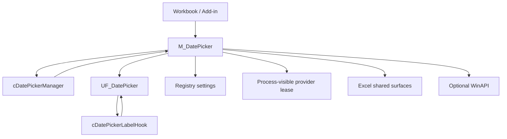

<div align="center">

# 📦 Installation and Upgrade Guide

### Installing, integrating, validating, upgrading, and removing VBA-DATETIMEPICKER

[](#-requirements)
[](#-choose-a-deployment-model)
[](#-requirements)
[](#-embedded-source-installation)
[](#-validation)

<br>

**Embedded source · Optional `.xlam` · Modeless UserForm · Settings namespaces · Single-provider protection · Source-built demo · Regression harness**

<br>

[Choose deployment](#-choose-a-deployment-model)
&nbsp;·&nbsp;
[Embedded source](#-embedded-source-installation)
&nbsp;·&nbsp;
[Add-in](#-xlam-add-in-installation)
&nbsp;·&nbsp;
[Upgrade](#-upgrade-guide)
&nbsp;·&nbsp;
[Validation](#-validation)
&nbsp;·&nbsp;
[Troubleshooting](#-troubleshooting)
&nbsp;·&nbsp;
[Removal](#-removing-the-component)

</div>

---

> [!IMPORTANT]
> **The primary deployment model is source-first.**
>
> Import the VBA source directly into the workbook when you want the DatePicker
> to travel with the file and work on managed Windows machines without requiring
> an add-in installation.
>
> A prebuilt `.xlam` is a convenience deployment, not a different implementation.

> [!WARNING]
> `v1.2.1` supports **one participating current-version DatePicker provider per
> Excel process**.
>
> Do not install the `.xlam` and also start an embedded `v1.2.1` copy in the same
> Excel session expecting both to operate independently. The second current-
> version provider is deliberately refused.
>
> A pre-`v1.2.0` copy does not participate in the lease protocol, so a mixed-
> version session is not protected by the new ownership model.

> [!NOTE]
> The macro-enabled demo workbook is not maintained as an opaque binary in Git.
> Demo `.xlsm` builds are generated from committed source and distributed as
> GitHub Release assets.

---

## 🧭 Requirements

| Requirement | Detail |
|---|---|
| 🖥️ Host | Microsoft Excel desktop for **Windows** |
| ⚙️ Office bitness | 32-bit and 64-bit supported |
| 📄 Host file | Macro-enabled workbook (`.xlsm` / `.xlsb`) or Excel add-in (`.xlam`) |
| 🧩 VBA | Excel VBA with MSForms/UserForms support |
| 📥 Source installer | None — import exported VBA components |
| 🔗 External runtime | None |
| 🧱 COM dependency | None |
| 📚 Third-party DLL | None |
| 🪟 WinAPI | Optional; required only for the Windows positioning/borderless enhancements |
| 🔐 Macro policy | The workbook/add-in must be allowed to run VBA under the user's organization policy |

The project is designed and documented for Windows desktop Excel.

The source contains conditional guards around Windows-specific code, but that
does not make Excel for macOS or Excel for the web a supported deployment target.

### Macro security

Do not weaken Excel macro security globally just to install this component.

Use your organization's approved approach, such as:

```text
trusted source
approved Trusted Location
digitally signed workbook/add-in
explicitly approved macro-enabled file
```

If Windows marks a downloaded `.xlam` or `.xlsm` as originating from the
Internet, the file's Properties dialog may show an **Unblock** option. Use it only
when you trust the file and your organization permits it.

---

## 🎯 Choose a deployment model

| Deployment | Best for | Admin rights | Travels with workbook | Available across workbooks |
|---|---|:---:|:---:|:---:|
| **Embedded source** | Shared business workbooks, locked-down desktops, source-controlled solutions | No | ✅ | ❌ |
| **Prebuilt `.xlam`** | Personal/team Excel environment where add-ins are allowed | Usually no admin, but policy-dependent | ❌ | ✅ |
| **Demo `.xlsm`** | Evaluation, training, screenshots, release validation | No | Self-contained demo | ❌ |

### Recommended choice

Use **embedded source** when:

- the workbook must be self-contained;
- recipients should not install anything;
- corporate devices restrict add-in deployment;
- the workbook source is reviewed or version-controlled;
- the DatePicker should exist only for that workbook solution.

Use the **`.xlam`** when:

- the same DatePicker should be available to many workbooks;
- Excel add-ins are permitted;
- one shared provider per Excel process is the intended deployment.

Use the **demo workbook** when:

- evaluating the component;
- learning the available behaviors;
- checking the UI before integrating the source.

> [!IMPORTANT]
> A settings namespace solves **persistent configuration isolation**.
>
> It does **not** allow two DatePicker providers to run concurrently.
>
> These are different concepts:
>
> ```text
> settings namespace     persistent identity across Excel sessions
> provider lease         runtime ownership inside one Excel process
> ```

---

## 📦 Production source package

A source installation requires these production components:

| Import order | Repository path | VBE component | Responsibility |
|---:|---|---|---|
| 1 | `src/modules/M_DatePicker.bas` | `M_DatePicker` | Public API, settings, write-back, integrations, provider lease, WinAPI helpers |
| 2 | `src/classes/cDatePickerManager.cls` | `cDatePickerManager` | Application-level Excel event orchestration |
| 3 | `src/classes/cDatePickerLabelHook.cls` | `cDatePickerLabelHook` | Runtime MSForms label-event routing |
| 4 | `src/forms/UF_DatePicker.frm` | `UF_DatePicker` | Modeless Date / Time Picker UserForm |

The form also requires its binary companion:

```text
src/forms/UF_DatePicker.frx
```

> [!IMPORTANT]
> Import `UF_DatePicker.frm` through the VBA Editor while
> `UF_DatePicker.frx` is in the **same directory**.
>
> The VBE reads the `.frx` automatically when importing the `.frm`.
>
> Do **not** try to import the `.frx` as a separate VBA component.

### Optional Ribbon source

```text
src/ribbon/customUI14.xml
```

RibbonX is **package metadata**, not a VBE module.

Importing the VBA source does not automatically install Ribbon XML.

See [Optional Ribbon integration](#-optional-ribbon-integration).

---

## 🧪 Optional development / validation source

| Path | Required for production? | Purpose |
|---|:---:|---|
| `test/M_cDP_Test.bas` | No | Regression harness |
| `demo/M_DEMO_BUILDER.bas` | No | Demo-building primitives and test dependency |
| `demo/M_DP_DEMO.bas` | No | Complete demo worksheet composition |

> [!IMPORTANT]
> `M_cDP_Test.bas` declares `M_DEMO_BUILDER` as a dependency.
>
> If you import the regression harness into a clean validation workbook, import:
>
> ```text
> test/M_cDP_Test.bas
> demo/M_DEMO_BUILDER.bas
> ```
>
> together with the production components before compiling.
>
> `M_DP_DEMO.bas` is required when building the full demo, not merely to run the
> standard regression harness.

---

## 🔗 Runtime architecture



The Application event manager owns selection/workbook event orchestration.

Do not create a second independent `Worksheet_SelectionChange` or
`Workbook_SheetSelectionChange` implementation merely to make the DatePicker
refresh. That duplicates responsibility already centralized in
`cDatePickerManager`.

---

# 🚀 Embedded source installation

This is the recommended installation for self-contained workbooks.

## 1. Prepare the destination workbook

Use a macro-enabled file:

```text
.xlsm
.xlsb
```

Before editing the VBA project:

1. save the workbook;
2. make a backup;
3. close unrelated workbooks if you are validating application-wide behavior;
4. confirm that no older DatePicker add-in is running in the same Excel process.

If an existing DatePicker installation is already present, use the
[Upgrade guide](#-upgrade-guide) instead of importing a second copy on top of it.

---

## 2. Open the VBA Editor

Press:

```text
Alt + F11
```

In Project Explorer, select the destination VBA project.

---

## 3. Import `M_DatePicker.bas`

Use:

```text
File → Import File...
```

and import:

```text
src/modules/M_DatePicker.bas
```

Project Explorer should show:

```text
Modules
└─ M_DatePicker
```

---

## 4. Import the two classes

Import:

```text
src/classes/cDatePickerManager.cls
src/classes/cDatePickerLabelHook.cls
```

Project Explorer should show:

```text
Class Modules
├─ cDatePickerManager
└─ cDatePickerLabelHook
```

Do not manually change their class instancing metadata.

---

## 5. Import the UserForm

Before importing, verify these two files are side-by-side:

```text
src/forms/UF_DatePicker.frm
src/forms/UF_DatePicker.frx
```

Then import **only**:

```text
UF_DatePicker.frm
```

The VBE loads the referenced `.frx` resource automatically.

Project Explorer should show:

```text
Forms
└─ UF_DatePicker
```

### If the form imports without its resources

Do not continue with a partially imported form.

Remove the broken `UF_DatePicker`, place the `.frm` and `.frx` together, and
import again.

A `.frm` without its matching `.frx` is not a complete source installation.

---

## 6. Compile the project

Run:

```text
Debug → Compile VBAProject
```

Do not skip this step.

A DatePicker that imports but does not compile is not installed.

### Expected production component set

At minimum:

```text
M_DatePicker
cDatePickerManager
cDatePickerLabelHook
UF_DatePicker
```

If compilation reports:

```text
Sub or Function not defined
User-defined type not defined
Ambiguous name detected
```

go directly to [Troubleshooting](#-troubleshooting).

---

## 7. Wire the workbook lifecycle

In `ThisWorkbook`, add:

```vb
Option Explicit

Private Sub Workbook_Open()

    DP_Start

End Sub

Private Sub Workbook_BeforeClose(Cancel As Boolean)

    DP_Stop

End Sub
```

`DP_Start` initializes the runtime integrations.

`DP_Stop` tears down the resources owned by that provider.

### With an isolated settings namespace

If this workbook should have its own persisted DatePicker settings:

```vb
Option Explicit

Private Sub Workbook_Open()

    M_Settings_SetNamespace "TreasuryTool"
    DP_Start

End Sub

Private Sub Workbook_BeforeClose(Cancel As Boolean)

    DP_Stop

End Sub
```

The ordering is mandatory:

```text
M_Settings_SetNamespace
        ↓
DP_Start
```

because `DP_Start` loads settings.

Do **not** call `M_Settings_SetNamespace` after settings have already been loaded.

---

## 8. Optional save/print visual cleanup

For workbooks that should never save or print with the modeless form/grid icon
visible:

```vb
Private Sub Workbook_BeforeSave(ByVal SaveAsUI As Boolean, Cancel As Boolean)

    If Cancel Then Exit Sub

    DP_Close
    M_GridIcon_PurgeAll

End Sub

Private Sub Workbook_BeforePrint(Cancel As Boolean)

    If Cancel Then Exit Sub

    DP_Close
    M_GridIcon_PurgeAll

End Sub
```

These handlers are host-integration policy.

Use them when they fit the workbook.

Do not duplicate Application selection management that belongs to
`cDatePickerManager`.

---

## 9. Save and reopen

Save the workbook.

Close Excel completely if you want to validate a true fresh-session startup.

Reopen the workbook and verify that `Workbook_Open` runs.

If macros are disabled or workbook events are not firing, `DP_Start` will not run
automatically.

You can test manually from the Immediate Window:

```vb
DP_Start
```

---

## 10. Perform a basic smoke test

Select an eligible date cell and run:

```vb
DP_Show
```

Verify:

1. the form opens modelessly;
2. the calendar shows a sensible initial date;
3. selecting a date writes the intended cell;
4. Excel remains interactive;
5. `DP_Close` closes the picker;
6. `DP_Stop` removes the owning provider's transient integrations.

Also try:

```vb
DP_Today
DP_Now
```

on a controlled test cell.

---

## 11. Verify safe table behavior

Create or use a test Excel Table.

Select one cell in a table data column and choose a date.

Expected normal behavior:

```text
one selected cell changes
```

not:

```text
the entire table column changes
```

Whole-column fill is explicit:

```vb
Dim Result As DP_WriteResult

Result = DP_FillTableColumn( _
            ValueToWrite:=VBA.Date, _
            ConfirmFill:=True)
```

This is a `Function` returning `DP_WriteResult`.

---

## 12. Verify formula preservation

Test a cell containing a formula that displays a date.

Open the picker from that cell and select another date.

Expected default:

```text
formula remains
```

The DatePicker may use a date-returning formula to initialize the picker without
treating that formula as disposable data.

Formula overwrite is an explicit advanced behavior, not the default.

---

# ⚙️ Settings namespaces

Without an explicit namespace, the DatePicker uses the stable legacy application
name:

```text
VBA_DATETIMEPICKER
```

under the current Windows user's VBA settings area.

That preserves backward compatibility, but it also means two deployments using
the default scope can share preferences across separate Excel sessions.

## When to use a namespace

Use a namespace when independent workbook solutions should retain independent
settings.

Example:

```vb
M_Settings_SetNamespace "CreditRiskTool"
DP_Start
```

Effective persistence is derived from the stable base name, for example:

```text
VBA_DATETIMEPICKER__CreditRiskTool
```

## Namespace rules

### Configure before load

Correct:

```vb
M_Settings_SetNamespace "CreditRiskTool"
DP_Start
```

Incorrect:

```vb
DP_Start
M_Settings_SetNamespace "CreditRiskTool"
```

Once settings are loaded, the namespace is locked for that project/session.

### Use a stable deployment identity

Good:

```text
CreditRiskTool
TreasuryDashboard
LoanOrigination
```

Avoid using:

```text
v1.2.0
Workbook1
C:\Users\Daniele\Desktop\Tool.xlsm
```

A namespace should survive version upgrades and file moves.

### No automatic migration

A newly selected namespace starts from DatePicker defaults.

The component does not silently copy the legacy global settings into it.

### Namespace ≠ provider lease

Two different namespaces still do **not** make two DatePicker providers safe to
run simultaneously.

Persistence and runtime ownership have different lifetimes.

---

# 🧭 Runtime provider ownership

`v1.2.0` protects participating current-version copies through a temporary,
process-visible provider lease.

Lease name:

```text
__VBA_DATETIMEPICKER_RUNTIME_PROVIDER_LEASE__
```

## Normal startup

```text
no current owner
    ↓
DP_Start acquires lease
    ↓
shared Excel registrations are installed
```

## Second current-version provider

```text
owner already present
    ↓
second provider refused on any entry path
    ↓
existing owner left untouched
```

The ownership check happens **before** shared registrations, on **every** entry
path — `DP_Start`, `DP_Show`, `DP_Preload`, `DP_Click`, `DP_OpenForActiveCell`,
the keyboard shortcut and `Ribbon_ShowPicker`.

> [!NOTE]
> Through `v1.2.0` only `DP_Start` consulted the lease. A refused copy could
> still reach the manager by another route, register shared state, and remove
> the owner's registrations during its own teardown. Corrected in `v1.2.1`
> ([#37](https://github.com/danielep71/VBA-DATETIMEPICKER/issues/37)).

## Teardown protection

A refused provider is not admitted on any entry path, and is not allowed to
register shared state or to dismantle the owner's runtime through:

```text
DP_Stop
DP_RepairRuntime
```

Those operations verify ownership.

## Project reset / stale lease

A VBA project reset can clear the local owner token while leaving the
process-visible lease alive.

The component deliberately fails closed.

Safest recovery:

```text
close all Excel windows
restart Excel
```

Because the lease is temporary, Excel removes it at process shutdown.

### Operator-only force release

If you are certain that **no other DatePicker provider is alive**, you can use:

```vb
DP_ForceReleaseProviderLease
```

> [!CAUTION]
> This command intentionally releases the lease without proving ownership.
>
> Do not use it merely because startup was refused.
>
> If you are unsure whether another provider exists, restart Excel instead.

---

# ⌨️ Built-in access paths

The three persisted built-in access paths are independent:

```text
right-click
in-grid icon
Ctrl + Shift + D
```

All three may be disabled.

That is valid configuration, and it is honored from `v1.2.1`. Through `v1.2.0`
the settings panel forced `Ctrl + Shift + D` back on whenever right-click and the
grid icon were both disabled — a setting the panel does not expose, so the change
was invisible ([#42](https://github.com/danielep71/VBA-DATETIMEPICKER/issues/42)).

The picker can still be opened through:

```vb
DP_Show
```

or through optional RibbonX / caller-provided buttons.

## Keyboard shortcut ownership

`Ctrl + Shift + D` uses:

```vb
Application.OnKey
```

Excel exposes no getter for the previous assignment.

If the DatePicker shortcut is enabled, it can displace another session-wide
binding for that key.

On removal, the DatePicker can restore Excel's default handling, but it cannot
reconstruct an unknown predecessor.

Enable the shortcut only when that key belongs to the DatePicker deployment.

---

# 🖼️ In-grid icon and protected sheets

The in-grid icon is a worksheet `Shape`.

On protected worksheets, Excel may prevent drawing-object operations even when
the target cell itself is editable.

If your workbook requires the icon under protection, configure worksheet
protection according to the workbook's security/design policy.

A common host pattern uses protection that allows VBA UI maintenance while
keeping user restrictions in place.

Remember:

```text
UserInterfaceOnly:=True
```

is not persisted by Excel across sessions and normally must be reapplied after
reopen.

If the icon cannot be used, the DatePicker can still be opened through other
enabled access paths or `DP_Show`.

---

# 🎗️ Optional Ribbon integration

Ribbon integration is optional.

Source:

```text
src/ribbon/customUI14.xml
```

## Important packaging distinction

`customUI14.xml` is not a VBA module.

You cannot install RibbonX by:

```text
VBE → File → Import File
```

It must be added to the Office Open XML package using an appropriate RibbonX
packaging workflow.

Typical choices are:

```text
a RibbonX-capable editor
manual OOXML package editing
a build/release process that injects the XML
the prebuilt DatePicker .xlam release asset
```

The VBA callbacks are supplied by `M_DatePicker`.

The XML defines the Office Ribbon surface that calls them.

## If you do not need RibbonX

Do nothing.

The DatePicker remains usable through:

```text
DP_Show
right-click
in-grid icon
keyboard shortcut
caller-provided button
```

---

# 🧩 `.xlam` add-in installation

Use the add-in when you want one DatePicker provider available across workbooks.

## 1. Obtain the release asset

Download the DatePicker `.xlam` from the GitHub Releases page. At `v1.2.1` the
assets are:

```text
DATETIMEPICKER v1.2.1.xlam
DATETIMEPICKER-demo-v1.2.1.xlsm
```

> [!IMPORTANT]
> The `.xlam` filename separator has varied between releases — `v1.2.0` published
> `DATETIMEPICKER.v1.2.0.xlam`. Take the exact name from the Release page rather
> than assuming it, and verify the published SHA-256:
>
> ```text
> certutil -hashfile "DATETIMEPICKER v1.2.1.xlam" SHA256
> ```

Use the release asset rather than a binary copied from an unknown source.

## 2. Place it in a stable local folder

Do not leave a production add-in in a temporary browser download folder that may
later be cleaned automatically.

Use a location permitted by your organization's Excel policy.

## 3. Unblock if required

If Windows shows an **Unblock** checkbox in:

```text
File → Properties
```

and you trust the downloaded file, unblock it if your organization permits.

Do not bypass enterprise macro policy.

## 4. Enable the add-in in Excel

Typical Excel path:

```text
File
→ Options
→ Add-ins
→ Manage: Excel Add-ins
→ Go...
→ Browse...
```

Select the `.xlam` and enable it.

Exact menu labels can vary slightly by Office build.

## 5. Restart Excel for a clean-session check

Close **all** Excel windows so the Excel process exits.

Reopen Excel.

This is especially useful after replacing an older DatePicker add-in because it
clears process-level runtime state and temporary leases.

## 6. Do not start a second provider

If a workbook also embeds `v1.2.1` source and calls any DatePicker entry point, the second
participating provider will be refused.

Choose one ownership model for a given Excel session.

---

# 🧪 Demo workbook installation

The demo `.xlsm` is a release asset for evaluation and validation.

## Open the demo

1. download the demo from the GitHub Release;
2. place it in an approved local folder;
3. unblock only if appropriate and permitted;
4. open it in desktop Excel for Windows;
5. enable macros according to your organization's policy.

The demo binary is not the authoritative source.

Its implementation is generated from committed VBA source under:

```text
demo/
```

The source repository remains the review artifact.

---

# 🔁 Upgrade guide

Before any upgrade:

```text
save work
make a backup
identify whether the provider is embedded or add-in
identify the currently loaded version
close unrelated Excel workbooks
```

Where practical, stop the existing provider before removing its code:

```vb
DP_Stop
```

---

## ⬆️ Upgrade an embedded `v1.1.x` installation to `v1.2.1`

Replace the complete DatePicker source set together.

Do not paste only selected procedures from the new version into the old module.

### 1. Back up the workbook

Create a recoverable copy before changing the VBA project.

### 2. Stop the old runtime

If the existing installation is healthy:

```vb
DP_Stop
```

### 3. Remove the old DatePicker source components

Remove/export as appropriate:

```text
M_DatePicker
cDatePickerManager
cDatePickerLabelHook
UF_DatePicker
```

Do not leave duplicate old classes/forms under altered names.

### 4. Import the complete current package

Import:

```text
src/modules/M_DatePicker.bas
src/classes/cDatePickerManager.cls
src/classes/cDatePickerLabelHook.cls
src/forms/UF_DatePicker.frm
```

with:

```text
UF_DatePicker.frx
```

beside the `.frm`.

### 5. Re-import the test harness if you use it

Regression code evolves with production code.

Replace:

```text
test/M_cDP_Test.bas
```

and ensure its declared demo-builder dependency is present.

### 6. Compile

```text
Debug → Compile VBAProject
```

### 7. Review behavioral changes

`v1.2.1` intentionally hardens several defaults.

#### Excel Table cells

Normal interactive selection is now safe single-cell scope.

If old host code depended on automatic whole-column behavior, replace that
assumption with explicit:

```vb
DP_FillTableColumn
```

#### Formula cells

Formulas are preserved by default.

Do not assume that selecting a new date destroys a formula.

#### Runtime ownership

A second participating `v1.2.1` provider is refused on every entry path.

Check for an old `.xlam` or another embedded copy before concluding that startup
is broken.

#### Settings namespaces

The legacy default settings scope is still available.

A namespace is opt-in and must be selected before `DP_Start`.

There is no automatic migration into a new namespace.

---

## ⬆️ Upgrade between `v1.2.1` development builds

Replace the complete production source set together:

```text
M_DatePicker
cDatePickerManager
cDatePickerLabelHook
UF_DatePicker.frm + UF_DatePicker.frx
```

Do not mix:

```text
new M_DatePicker
old form
old manager
```

even if the project happens to compile.

The internal contracts and regression assumptions evolve together.

Re-import:

```text
M_cDP_Test.bas
M_DEMO_BUILDER.bas
```

when validating the branch.

---

## ⬆️ Upgrade the `.xlam`

Do not overwrite an add-in binary while it is loaded.

Recommended sequence:

1. disable/uncheck the existing DatePicker add-in;
2. close **all** Excel windows;
3. confirm the Excel process has exited;
4. replace or relocate the `.xlam`;
5. reopen Excel;
6. enable the new add-in;
7. perform the validation smoke test.

Closing Excel also clears the temporary provider lease.

---

## ⚠️ Mixed-version warning

This is protected:

```text
v1.2.1 provider
+
v1.2.1 provider
=
second provider refused
```

This is **not guaranteed safe**:

```text
v1.2.1 provider
+
v1.1.x provider
```

The older provider has no lease awareness.

When upgrading, remove or disable the old provider rather than relying on the new
one to protect the session in both directions.

---

# ✅ Validation

Installation validation has two levels:

```text
consumer smoke validation
optional developer regression validation
```

---

## ✅ Consumer smoke validation

After a source or add-in install, use a controlled workbook.

### Startup

```vb
DP_Start
```

Expected:

```text
no ownership conflict
runtime available
```

### Show/close

```vb
DP_Show
DP_Close
```

### Write today/now

```vb
DP_Today
DP_Now
```

Use test cells whose existing values you are prepared to change.

### Table scope

Verify:

```text
single selected table cell
→ one cell written
```

and explicit:

```vb
DP_FillTableColumn
```

for whole-column intent.

### Formula safety

Verify a formula cell remains a formula under normal interactive write-back.

### Stop/restart

```vb
DP_Stop
DP_Start
```

The owning provider should be able to tear down and start again cleanly.

### Access paths

If enabled, verify the applicable paths:

```text
right-click
in-grid icon
Ctrl + Shift + D
Ribbon
```

Do not treat a deliberately disabled access path as an installation defect.

---

## 🧪 Developer regression validation

Import:

```text
test/M_cDP_Test.bas
demo/M_DEMO_BUILDER.bas
```

alongside the production source.

Then:

```text
Debug → Compile VBAProject
```

Run:

```vb
TST_DP_RunAll
```

For UI/form changes:

```vb
TST_DP_RunAll_WithUISmoke
```

Environment diagnostics:

```vb
TST_DP_ReportEnvironment
```

### Harness states

A run reports one of:

```text
PASS
FAIL
FAIL_CLEANUP
FAIL_DIRTY_START
INCOMPLETE_SKIPPED
```

Only:

```text
PASS
```

is a valid passing run.

The latest recorded `v1.2.1` figures, on both the embedded `.xlsm` and the
packaged `.xlam`, are:

```text
standard:       State=PASS; Run=431; Passed=431; Failed=0; CleanupFailures=0
with UI smoke:  State=PASS; Run=434; Passed=434; Failed=0; CleanupFailures=0
```

The assertion count is not a permanent magic number.

If the suite legitimately gains tests, the count should change.

### What PASS means

A valid `PASS` requires:

```text
clean start
+
mandatory suites complete
+
assertions pass
+
cleanup succeeds
+
final state verified
```

---

## 🧹 Dirty-start protection

The harness refuses to treat a contaminated predecessor state as valid evidence.

It checks, among other things, for a leftover:

```text
TST_DP_SCRATCH
```

worksheet.

A project reset can clear module variables without deleting that worksheet, which
is why the worksheet is a separate dirty-start signal.

If you receive:

```text
FAIL_DIRTY_START
```

do not interpret later assertion output as meaningful current-run evidence.

Use:

```vb
TST_DP_ReportEnvironment
```

inspect the controlled test host, clean the predecessor state, and rerun from a
known clean session.

Restarting Excel is often the cleanest reset when application-level state is in
doubt.

---

## 🧪 `Worksheets.Add` recovery behavior

During harness development, Excel was observed reporting error 1004 after a new
worksheet had already appeared.

The harness therefore does **not** blindly retry `Worksheets.Add`.

Its recovery policy distinguishes:

```text
zero new worksheets
exactly one new worksheet
more than one new worksheet
```

Only one unambiguous, validated candidate can be adopted.

If setup reports an ambiguous state, inspect the workbook rather than repeatedly
rerunning the harness and creating more uncertainty.

---

# 🧭 Application event-state contract

Normal DatePicker entry points preserve the caller's:

```vb
Application.EnableEvents
```

state.

That includes ordinary bootstrap/show logic.

If a business macro deliberately runs with:

```vb
Application.EnableEvents = False
```

normal DatePicker entry points should not silently turn events back on.

## Explicit exception

```vb
DP_RepairRuntime
```

is a recovery operation and may deliberately re-enable events.

> [!CAUTION]
> Do not call `DP_RepairRuntime` inside a transaction that depends on events
> remaining disabled unless that state change is intended.

`DP_WriteResult.EventsDisabledByCaller` records the caller event state observed
by write-back.

`DP_WriteResult` also carries `TechnicalFailureOccurred`, `TechnicalFailureStep`,
`TechnicalFailureNumber` and `TechnicalFailureDescription`. On a discontiguous
(multi-area) write the result reports the outcomes actually observed; the
original error is raised only when no cell produced any outcome. Test
`TechnicalFailureOccurred` before reconciling the counts.

---

# 🆘 Runtime recovery

Use the least destructive recovery that fits the problem.

## Close the form only

```vb
DP_Close
```

Use when the form/UI should close but the provider remains installed.

## Stop the owning provider

```vb
DP_Stop
```

Use for normal runtime teardown.

## Repair runtime registrations

```vb
DP_RepairRuntime
```

Use when runtime integration is damaged and you deliberately want repair.

Remember that this is the explicit path that may re-enable Excel events.

## Stale provider lease

Safest:

```text
close all Excel windows
restart Excel
```

## Force release

Only when you know no other provider is alive:

```vb
DP_ForceReleaseProviderLease
```

---

# 🧯 Troubleshooting

| Symptom | Most likely cause | Action |
|---|---|---|
| `Sub or Function not defined` | Missing source component or optional test dependency | Import the complete required set and compile |
| `Ambiguous name detected` | Old/duplicate component still present | Remove duplicate module/class/form |
| UserForm imports incorrectly | `.frx` missing/mismatched | Put matching `.frm` + `.frx` together and re-import |
| Picker does not start automatically | Macros or workbook events did not run | Check macro policy; test `DP_Start` manually |
| `DP_Start` reports another provider | Another current-version copy owns the session or lease is stale | Identify provider; restart Excel if ownership is uncertain |
| `DP_Stop` / `DP_RepairRuntime` refused | Current project cannot prove ownership | Do not force teardown of another provider |
| Formula did not change | Formula-preservation policy | Expected default behavior |
| Only one Table cell changed | Safe single-cell default | Use `DP_FillTableColumn` for explicit whole-column fill |
| Keyboard shortcut missing | Disabled setting, competing session assignment, or provider not started | Check configuration and ownership |
| Right-click entry missing | Disabled setting or runtime registration issue | Check settings; repair only if intended |
| Grid icon missing | Disabled setting, ineligible cell, protection/drawing restriction | Check target/protection/settings |
| Grid icon reference fails after sheet deletion | Stale Shape lifecycle | Current code should re-resolve; report if reproducible |
| Borderless UI not applied | WinAPI disabled/policy/host difference | Check Windows host and DatePicker WinAPI setting |
| Picker refuses to open after a window-style failure | Style was neither fully applied nor rolled back; presentation refused by design | Check the WinAPI setting and host; a later load is unaffected |
| Test reports `FAIL_DIRTY_START` | Previous run left observable state | Clean test host / restart Excel and rerun |
| Test setup reports worksheet ambiguity | Partial-success setup state | Inspect; do not blindly retry |
| Settings seem shared across workbooks | Both deployments use legacy default namespace | Configure stable namespace before `DP_Start` |
| Settings namespace call fails | Settings already loaded | Move namespace call before `DP_Start` |

---

## ❌ `Sub or Function not defined`

Check that the production installation contains:

```text
M_DatePicker
cDatePickerManager
cDatePickerLabelHook
UF_DatePicker
```

For regression testing also include:

```text
M_cDP_Test
M_DEMO_BUILDER
```

Then:

```text
Debug → Compile VBAProject
```

---

## ❌ `Ambiguous name detected`

A previous source component may still exist.

Common causes:

```text
M_DatePicker imported twice
old class left under original name
old UserForm not removed before upgrade
experimental copy still in project
```

Remove duplicates and import one coherent source set.

---

## ❌ UserForm imports without the expected design

Verify:

```text
UF_DatePicker.frm
UF_DatePicker.frx
```

came from the same commit/release and are in the same directory during import.

Do not mix a newer `.frm` with an older `.frx`.

---

## ⚠️ `DP_Start` refuses because a provider is already active

First determine whether another DatePicker is actually loaded.

Check for:

```text
installed DatePicker .xlam
another embedded workbook copy
another open development workbook
```

If another participating provider is running, refusal is correct.

If a VBA reset stranded the lease and you are uncertain about ownership, restart
Excel.

Do not use force release merely to make the message disappear.

---

## ⚠️ Formula cell remains unchanged

That is the normal safety policy.

A date-returning formula can be eligible for picker initialization while still
being protected from destructive write-back.

Use explicit formula-overwrite behavior only where the calling API supports it
and the destructive intent is deliberate.

---

## ⚠️ Table column no longer fills automatically

That is intentional in `v1.2.0`.

Normal write:

```text
selected cell
```

Explicit broad write:

```vb
DP_FillTableColumn
```

This separates ordinary date selection from whole-column mutation.

---

## ⚠️ `Ctrl + Shift + D` conflicts with another add-in

The shortcut is application-wide.

Excel provides no supported getter for the previous assignment.

The DatePicker can remove its own binding and return the key to Excel default
handling, but it cannot restore an unknown third-party predecessor.

Choose another DatePicker access path if that key belongs to another solution.

---

## ⚠️ In-grid icon does not appear on a protected sheet

Worksheet Shape permissions are separate from whether the selected cell is
unlocked.

Review the host workbook's protection settings.

If drawing objects are prohibited, use:

```text
right-click
keyboard
Ribbon
DP_Show
```

instead of weakening protection automatically.

---

## ⚠️ Unexpected settings from another workbook

Without a namespace, the legacy settings scope is shared for the same Windows
user.

Use:

```vb
M_Settings_SetNamespace "StableDeploymentName"
DP_Start
```

for independent persisted settings.

Do not use a version number as the namespace.

---

# 🔐 Security and deployment hygiene

Use only source or release assets obtained from the expected repository/release.

Before deploying:

- review the source if required by your organization;
- use approved macro locations/signing policy;
- avoid copying `.xlam` binaries from unknown machines;
- do not embed credentials or client-specific secrets in DatePicker source;
- do not disable Trust Center protections globally;
- validate the exact Office build/bitness used by the target environment.

For security issues, follow:

[SECURITY.md](SECURITY.md)

---

# 📦 Building the demo release asset

For maintainers/release preparation:

1. start from the intended release source;
2. import the production package;
3. import:

   ```text
   demo/M_DEMO_BUILDER.bas
   demo/M_DP_DEMO.bas
   ```

4. compile;
5. build the demo using the committed demo source;
6. run the applicable source regression and UI validation;
7. save the generated workbook **outside the Git-tracked source tree**;
8. name it to match the published release asset — `DATETIMEPICKER-demo-v1.2.1.xlsm` at `v1.2.1`;
9. attach it to the GitHub Release;
10. record release provenance/evidence to the extent supported by the current
    release process.

Do not hand-edit the binary after validation and then publish it as though the
commit still fully describes its contents.

---

# 📦 Building the `.xlam` release asset

For release preparation:

1. start from the intended source commit;
2. import the production components;
3. package optional RibbonX if part of the release add-in;
4. compile;
5. validate runtime startup/show/close/stop;
6. validate the source regression in the relevant controlled host;
7. perform package-level smoke checks on the actual `.xlam`;
8. close Excel before replacing/signing/copying the binary;
9. publish the add-in as a GitHub Release asset;
10. record the asset/source binding supported by the release process.

> [!IMPORTANT]
> A passing source regression does not by itself prove that a later-saved `.xlam`
> is byte-for-byte the artifact that was tested.
>
> Package certification and source regression are related but distinct evidence.

---

# 📐 Repository line endings and binary handling

The root `.gitattributes` defines repository behavior.

Key policy:

```text
*.bas / *.cls / *.frm    CRLF in the working tree
*.frx                    binary
Markdown/config          LF
Office binaries          binary
```

> [!NOTE]
> The GitHub source ZIP honors `export-ignore`, so `.gitattributes`, `.gitignore`,
> `.github/` and `.editorconfig` are **not present in it**. This line-ending
> policy applies to clones; files extracted from the ZIP arrive with whatever the
> archive stored and carry no attributes to re-apply.

Do not manually normalize exported VBA source to LF.

Do not line-merge `.frx`.

Generated `.xlsm` / `.xlam` files are release artifacts and should remain
outside normal source-control commits.

---

# 🗑️ Removing the component

## Remove an embedded installation

### 1. Stop the runtime

If the current provider is healthy and owns the session:

```vb
DP_Stop
```

### 2. Remove host lifecycle calls

Remove DatePicker calls from:

```text
Workbook_Open
Workbook_BeforeClose
Workbook_BeforeSave
Workbook_BeforePrint
```

where you added them.

### 3. Remove optional RibbonX

If the workbook package was customized with DatePicker RibbonX, remove that
custom UI package through the same RibbonX/OOXML workflow used to add it.

Deleting VBA callbacks while leaving Ribbon XML behind produces dead controls.

### 4. Remove VBA components

Remove:

```text
M_DatePicker
cDatePickerManager
cDatePickerLabelHook
UF_DatePicker
```

Remove optional test/demo modules when no longer required.

### 5. Compile the remaining project

```text
Debug → Compile VBAProject
```

### Persisted settings

Removing the VBA source does not inherently erase previously persisted
DatePicker settings from the current Windows user's VBA settings store.

That is intentional: settings persistence has a different lifetime from the
workbook source.

If registry cleanup is required by a deployment policy, perform it deliberately
for the exact legacy/namespace scope rather than deleting broad VBA settings.

---

## Remove the `.xlam`

1. disable/uncheck the DatePicker in Excel Add-ins;
2. close all Excel windows;
3. confirm Excel has exited;
4. remove the `.xlam` from its installed location if desired;
5. reopen Excel and verify no DatePicker provider starts.

Closing Excel clears the temporary provider lease.

---

## Remove the demo workbook

Close it and delete the downloaded `.xlsm`.

No installation is required by the demo itself beyond normal macro-enabled
workbook execution.

---

# ✅ Final installation checklist

## Embedded source

```text
[ ] Macro-enabled host created/backed up
[ ] M_DatePicker.bas imported
[ ] cDatePickerManager.cls imported
[ ] cDatePickerLabelHook.cls imported
[ ] UF_DatePicker.frm imported with matching UF_DatePicker.frx beside it
[ ] Debug → Compile VBAProject passes
[ ] Optional namespace configured before DP_Start
[ ] Workbook_Open calls DP_Start
[ ] Workbook_BeforeClose calls DP_Stop
[ ] DP_Show opens the modeless picker
[ ] Date selection writes only intended scope
[ ] Formula preservation checked where relevant
[ ] Table single-cell default checked where relevant
[ ] DP_Stop completes from owning provider
```

## Add-in

```text
[ ] Official release asset obtained
[ ] File stored in approved stable location
[ ] Macro/trust policy satisfied
[ ] Add-in enabled
[ ] No second embedded/current-version provider is being started
[ ] Fresh Excel process tested
[ ] DP_Show / DP_Close smoke tested
```

## Developer validation

```text
[ ] M_cDP_Test.bas imported
[ ] M_DEMO_BUILDER.bas imported
[ ] Debug → Compile VBAProject passes
[ ] TST_DP_RunAll executed
[ ] State=PASS
[ ] Failed=0
[ ] CleanupFailures=0
[ ] UI smoke executed when applicable
[ ] Manual provider/WinAPI scenarios executed when applicable
[ ] Actual environment recorded
```

---

<div align="center">

## 📌 Installation principle

**Import one coherent source set. Configure persistence before startup. Allow one runtime owner. Validate the behavior you actually deploy.**

</div>
