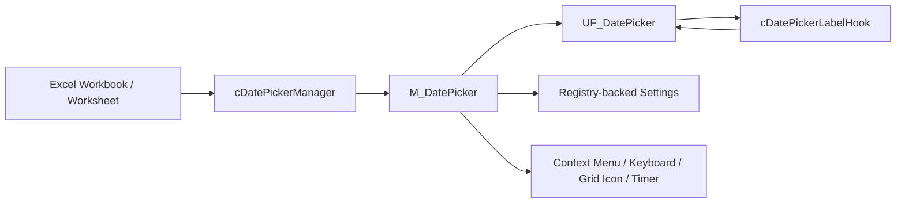

# VBA-DATETIMEPICKER

<p align="center">
  <b>A modern, reusable, worksheet-friendly Date / Time Picker for Excel VBA</b><br>
  Clean UI • Smart cell detection • In-grid activation • Modeless workflow • Enterprise-friendly architecture
</p>

<p align="center">
  
  
  
  
  
  
</p>

---


---


## ✨ Overview

<p align="left">
  
  
  
</p>

**VBA-DATETIMEPICKER** is a modern, modular, and worksheet-friendly **Date / Time Picker for Excel VBA**.

It is designed for developers who want a cleaner and more intuitive way to handle date input in Excel without forcing users to type dates manually or interact with rigid modal dialogs.

The component provides a **modeless UserForm**, contextual worksheet integration, in-form settings, keyboard shortcuts, live-clock support, right-click access, and optional in-grid activation.

Built as part of a broader **Excel VBA Runtime Framework**, this project focuses on:

- 📅 better date and date-time entry UX in Excel
- 🧩 modular, maintainable VBA architecture
- ⚙️ reusable infrastructure for enterprise workbooks and add-ins
- 🧪 demo-ready and regression-friendly implementation patterns
- 🛡️ defensive lifecycle cleanup for real Excel environments

---

## ⭐ Why this exists

<p align="left">
  
  
  
</p>

Excel still powers an enormous number of business-critical workflows, but native date-entry UX is often poor.

This repository exists to provide a **clean, modern, and reusable VBA-based solution** for a very common problem:

> making date input in Excel feel much better without sacrificing control, portability, or maintainability.

The project is intentionally more than a visual widget. It includes manager-driven event handling, settings persistence, workbook lifecycle cleanup, runtime control creation, and a clear separation between **Excel integration**, **form rendering**, and **label-event routing**.

---

## 🚀 Key features

<p align="left">
  
  
  
  
  
  
  
  
  
  
</p>

- 📌 **Modeless Date / Time Picker UserForm**  
  Keeps Excel usable while the picker remains open.

- 6x7 calendar grid
- Month and year navigation
- Multi-cell write-back support
- Table-column friendly behavior
  
- 🧠 **Smart date-cell detection**  
  Can react to date-like values, date-formatted cells, and configured entry points.

- 🔁 **Repeated write-back workflow**  
  Supports efficient workflows where users select multiple target cells and write dates repeatedly.

- ⚙️ **In-form settings panel**  
  Settings are exposed inside the picker, with display, behavior, and integration pages.

- ⌨️ **Mouse and keyboard navigation**  
  Supports arrow keys, month/year navigation, Today, Now, Esc handling, and letter shortcuts.

- 🕒 **Today and Now shortcuts**  
  Allows date-only write-back or date-time write-back with the current system time.

- 🧱 **Manager / UI / hook separation**  
  Application events, UserForm rendering, and runtime label events are separated into focused components.

- 🧹 **Lifecycle cleanup**  
  Includes explicit cleanup paths for timers, UserForms, right-click menu entries, keyboard shortcuts, and in-grid worksheet icons.

- 🖱️ **Optional In-grid activation icon**  
  Shows a contextual worksheet shape next to eligible cells, with hide / move / reuse behavior for high-frequency selection changes.

- Optional compact mode
- Optional close after selection
- Optional highlight weekends
- optional first day of week
- Optional live clock
- Optional local names
- Optional allow outside-month selection
- Optional right-click integration
  
---

## 📸 Screenshots


### Main picker


### Settings panel


### In-grid activation


---

## 🧩 Compatibility 

- Microsoft Excel for Windows
- Excel 2016 and later
- Office 32-bit and 64-bit
- VBA UserForms
- No external runtime dependency

---

## 🏗️ Architecture

<p align="left">
  
  
  
</p>

The project is organized around a clean separation of responsibilities.



### `M_DatePicker.bas`

Shared public API and infrastructure module responsible for:

- `DP_Start`, `DP_Stop`, `DP_Show`, `DP_Close`
- `DP_Today`, `DP_Now`
- manager bootstrap through `M_Picker_EnsureManager`
- settings load/save and registry persistence
- context-menu integration
- keyboard shortcut integration
- in-grid icon creation, move, hide, remove, and purge
- live-clock timer infrastructure
- optional WinAPI styling and mouse positioning helpers
- selected-date write-back policy and form bridge state

### `cDatePickerManager.cls`

Application-level controller responsible for:

- Excel Application event hooks
- selection-driven DatePicker refresh
- stale UI cleanup
- workbook/worksheet context handling
- reentrancy protection
- high-frequency in-grid icon show / move / hide behavior
- hard-boundary cleanup before save, print, close, or teardown

The manager is intended to be an internal controller. If used only inside this VBA project, set the class `Instancing` property to **Private**.

### `UF_DatePicker.frm`

Dedicated UI layer responsible for:

- UserForm shell formatting
- runtime creation and reuse of labels, frames, pages, MultiPage controls, ComboBoxes, and CheckBoxes
- header month/year captions and navigation
- fixed 6 × 7 calendar-grid rendering
- paired day-cell labels for larger hover and click targets
- month/year picker overlay
- in-form settings overlay
- Today / Now footer actions
- compact layout behavior
- live footer-clock display
- keyboard navigation and shortcut routing

The form uses the user-facing caption **Date / Time Picker**.

### `cDatePickerLabelHook.cls`

Lightweight `WithEvents` routing class responsible for:

- click routing for runtime-created MSForms labels
- day-label hover routing
- header-label hover routing
- picker-panel hover routing
- footer-label hover routing
- settings-panel hover routing

The class intentionally avoids dead mouse-leave lifecycle code. Hover reset is centrally managed by the form through its hover trackers and `UserForm_MouseMove` cleanup path.

---

## 🧠 Design notes

<p align="left">
  
  
  
</p>

This repo follows a few core principles:

- **Excel-first UX**  
  The picker should feel natural inside worksheet workflows.

- **Reusable VBA engineering**  
  The solution should be portable across workbooks and projects.

- **Separation of concerns**  
  UI rendering, orchestration, infrastructure, and event routing remain clearly separated.

- **Safe event handling**  
  Reentrancy guards, explicit cleanup, and Application-level event ownership matter in real Excel environments.

- **Settings are explicit**  
  Runtime settings are changed through the in-form Settings panel and persisted through an explicit Save action.

- **High-frequency UI paths stay cheap**  
  The in-grid icon is hidden / moved / reused during selection refreshes, while explicit disable / teardown paths remove or purge it.

- **Production-minded code quality**  
  This is intended as a robust, reusable component, not only a demo widget.

---

## 📦 Repository structure

<p align="left">
  
  
  
</p>

```text
VBA-DATETIMEPICKER/
├─ src/
│  ├─ modules/
│  │  └─ M_DatePicker.bas
│  ├─ classes/
│  │  ├─ cDatePickerManager.cls
│  │  └─ cDatePickerLabelHook.cls
│  └─ forms/
│     ├─ UF_DatePicker.frm
│     └─ UF_DatePicker.frx
├─ demo/
│  └─ DatePicker Demo.xlsm
├─ assets/
│  ├─ datepicker-main.png
│  ├─ datepicker-settings.png
│  ├─ datepicker-ingrid.png
│  └─ vba-datetimepicker-social-preview.png
├─ README.md
└─ LICENSE
```

> Important: if the exported UserForm references `UF_DatePicker.frx`, keep the `.frm` and `.frx` together in source control.

---

## 🛠️ Installation

<p align="left">
  
  
  
</p>

### Option 1 — Import into an existing VBA project

1. Open the target workbook in Excel.
2. Open the VBA Editor with `Alt + F11`.
3. Import the source files:
   - `M_DatePicker.bas`
   - `cDatePickerManager.cls`
   - `cDatePickerLabelHook.cls`
   - `UF_DatePicker.frm`
   - `UF_DatePicker.frx`, if referenced by the exported form
4. Ensure the **Microsoft Forms 2.0 Object Library** is available.
5. Add the workbook lifecycle calls shown below.
6. Compile the VBA project.
7. Save as `.xlsm`, `.xlsb`, or package into your preferred add-in/deployment format.

### Option 2 — Use the demo workbook

Open the included demo workbook to:

- explore the picker behavior
- validate the interaction model
- test settings persistence
- test right-click, keyboard, and in-grid icon entry points
- use the demo as a starting point for integration

---

## 🔁 Workbook lifecycle

<p align="left">
  
  
  
</p>

The workbook lifecycle should stay thin. Let `cDatePickerManager` own Application-level events, and use workbook events only to start and stop the component.

Recommended `ThisWorkbook` pattern:

```vba
Option Explicit

Private Sub Workbook_Open()

    On Error GoTo ErrorHandler

    DP_Start

    Exit Sub

ErrorHandler:
    Debug.Print "ThisWorkbook.Workbook_Open" & _
        " | Error=" & VBA.CStr(Err.Number) & _
        " | " & Err.Description
    Err.Clear

End Sub

Private Sub Workbook_BeforeClose(Cancel As Boolean)

    On Error Resume Next

    If Cancel Then Exit Sub

    DP_Stop

    Err.Clear
    On Error GoTo 0

End Sub

Private Sub Workbook_BeforeSave(ByVal SaveAsUI As Boolean, Cancel As Boolean)

    On Error Resume Next

    If Cancel Then Exit Sub

    DP_Close
    M_GridIcon_PurgeAll

    Err.Clear
    On Error GoTo 0

End Sub

Private Sub Workbook_BeforePrint(Cancel As Boolean)

    On Error Resume Next

    If Cancel Then Exit Sub

    DP_Close
    M_GridIcon_PurgeAll

    Err.Clear
    On Error GoTo 0

End Sub
```

Do **not** duplicate worksheet `SelectionChange` logic in `ThisWorkbook`. The manager already handles selection changes through Application-level events.

---

## ⚙️ Configuration

<p align="left">
  
  
  
</p>

Settings are stored using VBA registry persistence under:

```text
HKCU\Software\VB and VBA Program Settings\VBA_DATETIMEPICKER
```

The legacy settings application name is intentionally retained as:

```text
VBA_DATETIMEPICKER
```

This preserves compatibility with existing saved settings.

Typical settings include:

| Area | Setting | Description |
|---|---|---|
| Display | First day of week | Sunday or Monday |
| Display | Local names | Use local month/day names or fixed English captions |
| Display | Live clock | Static or live footer time display |
| Display | Compact layout | Shorter picker layout with header settings access |
| Display | Highlight weekends | Bold weekend day labels |
| Behavior | Allow outside-month selection | Allow adjacent-month dates visible in the grid to be selected |
| Behavior | Close after selection | Close the picker after a successful write-back |
| Integration | Right-click menu | Add Date / Time Picker to the Excel cell context menu |
| Integration | In-grid icon | Show a contextual worksheet activation icon |
| Integration | WinAPI styling | Use optional Windows-specific styling such as title-bar removal |
| Integration | Keyboard shortcut | Fallback entry point when visual/contextual entry points are disabled |

---

## 🧩 Public API

<p align="left">
  
  
  
</p>

Primary public entry points are exposed through `M_DatePicker.bas`.

| Procedure | Purpose |
|---|---|
| `DP_Start` | Starts DatePicker runtime integrations and ensures the manager is available |
| `DP_Stop` | Stops runtime integrations and clears transient UI artifacts |
| `DP_Show` | Opens or refreshes the Date / Time Picker for the active target context |
| `DP_Close` | Closes the picker and stops form-level runtime activity |
| `DP_Today` | Writes today’s date to the current target |
| `DP_Now` | Writes today’s date with the current system time to the current target |
| `DP_RepairRuntime` | Repairs runtime state, including event enablement and manager recreation |
| `M_Picker_EnsureManager` | Ensures settings are loaded, forces `Application.EnableEvents = True`, and creates or repairs the manager |
| `M_ContextMenu_Update` | Synchronizes right-click menu integration with current settings |
| `M_KeyboardShortcut_Update` | Synchronizes keyboard shortcut integration with current settings |
| `M_GridIcon_PurgeAll` | Removes all DatePicker grid icons from open workbooks |

A normal consumer should usually call only:

```vba
DP_Start
DP_Show
DP_Close
DP_Stop
```

The manager class should normally be treated as internal infrastructure rather than directly instantiated by workbook code.

---

## 🖱️ Entry points

<p align="left">
  
  
  
</p>

The Date / Time Picker can be opened through several user-facing paths:

- right-click menu entry
- in-grid icon next to eligible cells
- keyboard shortcut fallback
- direct macro call to `DP_Show`

The project intentionally keeps `VBA_DATETIMEPICKER` as a stable internal command-bar tag / settings name, while user-facing captions should use:

```text
Date / Time Picker
```

---

## 🧭 Keyboard navigation

<p align="left">
  
  
  
</p>

Typical keyboard behavior includes:

| Key | Action |
|---|---|
| `←` / `→` | Move one day backward / forward |
| `↑` / `↓` | Move one week backward / forward |
| `PageUp` / `PageDown` | Move one month backward / forward |
| `Ctrl + PageUp` / `Ctrl + PageDown` | Move one year backward / forward |
| `Home` / `End` | Move to first / last day of displayed month |
| `Enter` / `Space` | Select the keyboard-highlighted date |
| `M` | Open month picker |
| `Y` | Open year picker |
| `T` | Write Today |
| `N` | Write Now |
| `Esc` | Hide overlay or close picker |

Letter shortcuts are ignored when Ctrl or Alt is pressed so the picker does not accidentally steal broader Excel or add-in shortcuts.

---

## 🧹 Runtime cleanup policy

<p align="left">
  
  
</p>

The project separates high-frequency UI cleanup from hard lifecycle cleanup:

| Situation | Recommended behavior |
|---|---|
| Selection refresh / non-eligible cell | Hide the in-grid icon |
| Eligible-cell selection change | Show, move, or reuse the in-grid icon |
| Feature disabled in settings | Remove the tracked icon |
| Workbook save / print / close | Purge all DatePicker icons |
| Form close / teardown | Stop timers and release form-level references |
| Workbook close / add-in unload | `DP_Stop` |

This avoids flicker during normal selection changes while still keeping workbook files clean when saving, printing, or closing.

---

## 🪟 WinAPI behavior

<p align="left">
  
  
</p>

The picker supports optional Windows-specific behavior for a more polished UI.

The intended policy is:

| Helper | Meaning |
|---|---|
| `M_Platform_CanUseWinAPI` | Platform capability check only |
| `M_Platform_ShouldUseWinAPI` | Capability plus user setting for optional styling |
| `M_Window_RemoveTitleBar` | Uses the styling policy |
| `M_Window_MoveFormToMouse` | Uses capability only, so positioning may still work when styling is disabled |

Disabling **Use WinAPI styling** should disable optional styling such as title-bar removal. It should not necessarily disable all safe Windows capability paths such as mouse-based positioning.

---

## 🧪 Demo quick start

<p align="left">
  
  
  
</p>

A good demo workbook should include:

- sample empty date-entry cells
- date-formatted input cells
- cells containing existing dates
- adjacent cells with non-date values
- a compact-layout scenario
- a right-click menu scenario
- an in-grid icon scenario
- Today and Now write-back examples
- a settings walkthrough
- cleanup checks before save, print, and close

Suggested validation areas:

- selection-change behavior
- workbook and worksheet activation handling
- cleanup after UI close
- month navigation
- year navigation
- outside-month selection policy
- multi-cell or repeated write-back workflow
- settings persistence
- WinAPI enabled / disabled behavior
- Application events repair through `M_Picker_EnsureManager` or `DP_RepairRuntime`

---

## ✅ Test quick start

<p align="left">
  
</p>

Before releasing or tagging a version:

1. Compile the VBA project.
2. Run `DP_Start`.
3. Confirm `Application.EnableEvents = True` after manager initialization.
4. Select eligible and non-eligible cells.
5. Confirm the in-grid icon shows, moves, hides, removes, and purges according to policy.
6. Open the picker with `DP_Show`.
7. Test day selection, Today, and Now.
8. Test month and year navigation.
9. Test settings save and persistence.
10. Test compact layout and normal layout.
11. Test WinAPI styling enabled and disabled.
12. Save, print-preview, and close the workbook to verify cleanup.
13. Reopen the workbook and confirm startup is clean.

Recommended Immediate Window checks:

```vba
? Application.EnableEvents
DP_Start
DP_Show
DP_Close
DP_Stop
```

---

## 🧯 Troubleshooting

<p align="left">
  
</p>

| Symptom | Check |
|---|---|
| Selection changes do not trigger picker behavior | Confirm `Application.EnableEvents = True` and run `DP_Start` |
| Form import fails or looks incomplete | Ensure `UF_DatePicker.frm` and `UF_DatePicker.frx` are both present |
| Right-click menu entry does not appear | Check settings, then run `M_ContextMenu_Update` |
| In-grid icon remains after disabling the feature | Run `M_GridIcon_PurgeAll`, then save settings again |
| Picker does not open near the mouse | Confirm platform capability and WinAPI declarations |
| Borderless styling does not apply | Confirm `gDP_UseWinAPI = True` and platform support |
| Settings appear stale | Open settings panel and use Save, or reload with `M_Settings_EnsureLoaded` |
| Events were disabled by another macro | Run `DP_RepairRuntime` or `M_Picker_EnsureManager` |

---

## 🧭 Roadmap

<p align="left">
  
</p>

Planned or possible future enhancements include:

- 📆 business-day / holiday-calendar integration
- 🧠 richer date-cell detection heuristics
- 🧩 tighter integration with reusable date/calendar modules
- 🎨 additional visual themes
- 🌐 improved localization options
- 🖱️ richer in-grid trigger behavior

---

## 🌐 Part of a broader framework

<p align="left">
  
  
</p>

**VBA-DATETIMEPICKER** is intended to sit naturally alongside other reusable Excel VBA components.

In a broader VBA engineering ecosystem, this repository can serve as the **date-input / calendar UX component**.

---

## 📚 Wiki

<p align="left">
  
  
</p>

For additional examples, notes, and repository-level guidance, see the project wiki:

[cDateTimePicker Wiki](https://github.com/danielep71/VBA-DATETIMEPICKER/wiki)

---

## 🔧 Coding style

<p align="left">
  
</p>

This repository follows a structured VBA style.

Typical routine headers include:

- PURPOSE
- WHY THIS EXISTS
- INPUTS
- RETURNS
- BEHAVIOR
- ERROR POLICY
- DEPENDENCIES
- NOTES
- UPDATED

General conventions:

- `Option Explicit`
- comments above executable lines
- inline comments only for declarations
- no comments inside `With ... End With`
- explicit cleanup / fail-safe logic where appropriate
- stable external behavior unless a change is deliberate and documented
- production-quality code intended for real Excel environments

---

## 🤝 Contributing

<p align="left">
  
  
  
</p>


Please aim to:

- preserve architectural clarity
- keep external behavior stable unless change is justified
- follow the project coding style
- document meaningful changes
- use clear commit messages
- compile before submitting changes

Conventional Commit examples:

- `feat(ui): add compact settings layout`
- `fix(manager): clean up stale in-grid icon on sheet change`
- `docs(readme): expand installation instructions`
- `refactor(hooks): simplify runtime label event routing`

---

## 📄 License

<p align="left">
  
</p>

---

## 👤 Author

<p align="left">
  
</p>

---

