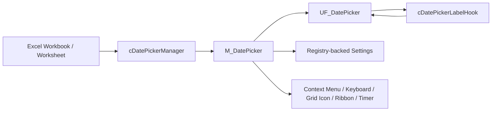

# VBA-DATETIMEPICKER

<p align="center">
  <b>A modern, reusable, worksheet-friendly Date / Time Picker for Excel VBA</b><br>
  Clean UI • Smart cell detection • In-grid activation • Modeless workflow • Enterprise-friendly architecture
</p>

<p align="center">
  
  
  
  
  
  
  
</p>

---


---


## ✨ Overview

<p align="left">
  
  
</p>

**VBA-DATETIMEPICKER** is a modern, modular, and worksheet-friendly **Date / Time Picker for Excel VBA**.

The component provides a **modeless UserForm**, contextual worksheet integration, in-form settings, keyboard shortcuts, live-clock support, right-click access, optional in-grid activation, and optional Ribbon callbacks.

Built as part of a broader **Excel VBA Runtime Framework**, this project focuses on:

- 📅 better date and date-time entry UX in Excel
- 🧩 modular, maintainable VBA architecture
- ⚙️ reusable infrastructure for enterprise workbooks and add-ins
- 🧪 demo-ready and regression-friendly implementation patterns
- 🛡️ defensive lifecycle cleanup for real Excel environments

---

## ⭐ Why this exists

<p align="left">
  
  
  
</p>

Excel still powers an enormous number of business-critical workflows, but native date-entry UX is often poor.

This repository exists to provide a **clean, modern, and reusable VBA-based solution** for a very common problem:

> making date input in Excel feel much better without sacrificing control, portability, or maintainability.

The project is intentionally more than a visual widget. It includes manager-driven event handling, settings persistence, workbook lifecycle cleanup, runtime control creation, and a clear separation between **Excel integration**, **form rendering**, and **label-event routing**.

---

## 🚀 Key features

<p align="left">
  
  
  
  
  
  
  
  
  
  
  
  
  
  
</p>

### 📌 Worksheet-friendly Date / Time input

The picker is designed for real Excel workflows, not only for isolated form demos.

- 📅 **Date-only write-back** through the Today shortcut and calendar selection
- 🕒 **Date-time write-back** through the Now shortcut
- 📌 **Modeless UserForm**, so Excel remains usable while the picker is open
- 🔁 **Repeated write-back workflow**, useful when users move across multiple target cells
- 🧾 **Table-column friendly behavior**, suitable for structured data-entry ranges

### 🧠 Smart activation and cell detection

The DatePicker can be shown through multiple entry points and can react to worksheet context.

- 🧠 Detects date-like values and date-formatted cells
- 🖱️ Supports optional **right-click menu** integration
- 🎯 Supports optional **in-grid activation icon** next to eligible cells
- ⌨️ Supports optional **keyboard shortcut** fallback
- 🎛️ Supports optional **Ribbon callbacks** for workbook or add-in Ribbon buttons
- 🧯 Prevents dead access configurations by preserving at least one practical entry path

### 🖱️ In-grid activation icon

The optional worksheet icon gives users a visible, contextual entry point directly in the grid.

- 🎯 Appears near eligible cells
- ⚡ Uses hide / move / reuse behavior for high-frequency selection changes
- 🧹 Can be removed when the feature is disabled
- 🧼 Can be purged during workbook cleanup, save, close, or reset paths

### 🗓️ Calendar rendering and navigation

The picker uses a fixed and predictable calendar surface.

- 🧱 Fixed **6 x 7 calendar grid**
- ◀️ Previous / next month navigation
- 🔼 Previous / next year navigation
- 📆 Month picker overlay
- 📅 Year picker overlay
- 🎯 Today, selected-date, keyboard-date, outside-month, weekend, disabled, and hover visual states

### ⌨️ Keyboard and mouse workflow

The component supports both mouse-first and keyboard-first usage.

- ⬅️ ➡️ ⬆️ ⬇️ Arrow-key day navigation
- 📄 PageUp / PageDown month navigation
- 🏁 Home / End navigation inside the displayed month
- ✅ Enter / Space selection
- ⎋ Esc close / overlay dismiss behavior
- 🔤 Letter shortcuts for Month, Year, Today, and Now actions

### 🪟 Borderless draggable window

The Date / Time Picker can run with a clean borderless visual style while still remaining movable by the user.

- 🪟 Supports optional borderless UserForm styling
- 🖱️ Allows the form to be moved from a custom header drag surface
- 🧭 Keeps normal picker controls clickable while only the passive header area acts as the drag surface
- 🛡️ Falls back safely when WinAPI support is unavailable
- 🧩 Keeps drag behavior separated from calendar, settings, and label-click logic

### ⚙️ In-form settings panel

Settings are exposed inside the picker through a compact overlay panel.

- 🖥️ **Display settings**
  - first day of week
  - local or fixed-English captions
  - live clock
  - compact layout
  - weekend highlighting

- 🧭 **Behavior settings**
  - close after selection
  - allow outside-month selection

- 🔌 **Integration settings**
  - right-click menu
  - in-grid icon
  - WinAPI styling

### 🧱 Clean internal architecture

The project separates responsibilities across focused components.

- 🧠 `cDatePickerManager` handles Excel application events and lifecycle orchestration
- 🖼️ `UF_DatePicker` handles the runtime UserForm, rendering, settings panel, and visual state
- 🔗 `cDatePickerLabelHook` routes events from runtime-created labels
- 🧰 `M_DatePicker` exposes the public API, settings, integration helpers, Ribbon callbacks, timers, and grid-icon infrastructure

### 🧹 Lifecycle and cleanup discipline

The DatePicker includes explicit cleanup paths for real workbook sessions.

- ⏱️ Stops live-clock timers
- 🧼 Closes loaded picker forms
- 🧹 removes or purges in-grid icons
- 🖱️ removes right-click menu entries
- ⌨️ removes keyboard shortcut assignments
- 🔁 repairs or restarts the manager when needed
- 🛡️ keeps `Application.EnableEvents` aligned when ensuring the manager

### 🏢 Enterprise-friendly VBA behavior

The implementation is designed for controlled Excel environments.

- 📦 No external installer required
- 🧩 Importable `.bas`, `.cls`, and `.frm` source files
- 🧠 Clear separation between UI, manager, hooks, and infrastructure
- 🧪 Demo-friendly and regression-friendly structure
- 🧾 Compatible with source-controlled VBA exports
  
---

## 📸 Screenshots


### Main picker


### Settings panel


### In-grid activation


---

## 🧩 Compatibility 

- Microsoft Excel for Windows
- Excel 2016 and later
- Office 32-bit and 64-bit
- VBA UserForms
- No external runtime dependency

---

## 🏗️ Architecture

<p align="left">
  
  
  
</p>

The project is organized around a clean separation of responsibilities.



### `M_DatePicker.bas`

Provides the shared companion module for the DatePicker project

- `DP_Start`, `DP_Stop`, `DP_Show`, `DP_Close`
- `DP_Today`, `DP_Now`
- manager bootstrap through `M_Picker_EnsureManager`
- settings load/save and registry persistence
- context-menu integration
- keyboard shortcut integration
- in-grid icon creation, move, hide, remove, and purge
- live-clock timer infrastructure
- optional WinAPI styling and mouse positioning helpers
- selected-date write-back policy and form bridge state

### `cDatePickerManager.cls`

Provides the central Excel Application event manager for the DatePicker project

The DatePicker uses several transient Excel / VBA UI surfaces:
  - modeless runtime UserForm
  - in-grid DatePicker icon
  - workbook, worksheet, window, save, print, close, and activation events
  - optional keyboard shortcut fallback

Centralizing the Application event flow in one manager class keeps the
project predictable, avoids duplicate event wiring, and prevents stale UI
artifacts from surviving normal Excel context transitions

The controller is responsible for:

- Excel Application event hooks
- selection-driven DatePicker refresh
- stale UI cleanup
- workbook/worksheet context handling
- reentrancy protection
- high-frequency in-grid icon show / move / hide behavior
- hard-boundary cleanup before save, print, close, or teardown


### `UF_DatePicker.frm`

Dedicated UI layer responsible for:

- UserForm shell formatting
- runtime creation and reuse of labels, frames, pages, MultiPage controls, ComboBoxes, and CheckBoxes
- header month/year captions and navigation
- fixed 6 × 7 calendar-grid rendering
- paired day-cell labels for larger hover and click targets
- month/year picker overlay
- in-form settings overlay
- Today / Now footer actions
- compact layout behavior
- live footer-clock display
- keyboard navigation and shortcut routing

The DatePicker form is built at runtime. This keeps layout, dynamic control creation, 
label-event routing, calendar rendering, month/year navigation, footer shortcuts, 
in-form settings, keyboard  navigation, and live-clock behavior centralized in one 
UserForm code-behind.

### `cDatePickerLabelHook.cls`

Runtime-created MSForms labels do not expose normal UserForm event
procedures. A WithEvents class is required to capture their Click and
MouseMove events.

It is responsible for:

- click routing for runtime-created MSForms labels
- day-label hover routing
- header-label hover routing
- picker-panel hover routing
- footer-label hover routing
- settings-panel hover routing

---

## 🧠 Design notes

<p align="left">
  
  
  
</p>

This repo follows a few core principles:

- **Excel-first UX**  
  The picker should feel natural inside worksheet workflows.

- **Reusable VBA engineering**  
  The solution should be portable across workbooks and projects.

- **Separation of concerns**  
  UI rendering, orchestration, infrastructure, and event routing remain clearly separated.

- **Safe event handling**  
  Reentrancy guards, explicit cleanup, and Application-level event ownership matter in real Excel environments.

- **Settings are explicit**  
  Runtime settings are changed through the in-form Settings panel and persisted through an explicit Save action.

- **High-frequency UI paths stay cheap**  
  The in-grid icon is hidden / moved / reused during selection refreshes, while explicit disable / teardown paths remove or purge it.

- **Production-minded code quality**  
  This is intended as a robust, reusable component, not only a demo widget.

---

## 📦 Repository structure

<p align="left">
  
  
  
</p>

```text
VBA-DATETIMEPICKER/
├─ src/
│  ├─ modules/
│  │  └─ M_DatePicker.bas
│  ├─ classes/
│  │  ├─ cDatePickerManager.cls
│  │  └─ cDatePickerLabelHook.cls
│  ├─ forms/
│  │  ├─ UF_DatePicker.frm
│  │  └─ UF_DatePicker.frx
│  └─ ribbon/
│     └─ customUI.xml
├─ demo/
│  └─ DatePicker Demo.xlsm
├─ assets/
│  ├─ datepicker-main.png
│  ├─ datepicker-settings.png
│  ├─ datepicker-ingrid.png
│  └─ vba-datetimepicker-social-preview.png
├─ README.md
└─ LICENSE
```
> Important: if the exported UserForm references `UF_DatePicker.frx`, keep the `.frm` and `.frx` together in source control.
> 
> Ribbon support is callback-based. The VBA callbacks live in a standard module, while the Ribbon layout itself must be provided through RibbonX / `customUI.xml` in the workbook or add-in package.
---

## 🛠️ Installation

<p align="left">
  
  
  
</p>

### Option 1 — Import into an existing VBA project

1. Open the target workbook in Excel.
2. Open the VBA Editor with `Alt + F11`.
3. Import the source files:
   - `M_DatePicker.bas`
   - `cDatePickerManager.cls`
   - `cDatePickerLabelHook.cls`
   - `UF_DatePicker.frm`
   - `UF_DatePicker.frx`, if referenced by the exported form
4. Ensure the **Microsoft Forms 2.0 Object Library** is available.
5. If Ribbon callbacks are used, ensure the workbook or add-in includes the matching RibbonX `customUI.xml`.
6. Add the workbook lifecycle calls shown below.
7. Compile the VBA project.
8. Save as `.xlsm`, `.xlsb`, or package into your preferred add-in/deployment format.

### Option 2 — Use the demo workbook

Open the included demo workbook to:

- explore the picker behavior
- validate the interaction model
- test settings persistence
- test right-click, keyboard, and in-grid icon entry points
- use the demo as a starting point for integration

---

## 🔁 Workbook lifecycle

<p align="left">
  
  
  
</p>

The workbook lifecycle should stay thin. Let `cDatePickerManager` own Application-level events, and use workbook events only to start and stop the component.

Recommended `ThisWorkbook` pattern:

```vba
Option Explicit

Private Sub Workbook_Open()
    DP_Start
End Sub

Private Sub Workbook_BeforeClose(Cancel As Boolean)
    DP_Stop
End Sub

Private Sub Workbook_BeforeSave(ByVal SaveAsUI As Boolean, Cancel As Boolean)

    If Cancel Then Exit Sub

    DP_Close
    M_GridIcon_PurgeAll

End Sub

Private Sub Workbook_BeforePrint(Cancel As Boolean)

    If Cancel Then Exit Sub

    DP_Close
    M_GridIcon_PurgeAll

End Sub
```

Do **not** duplicate worksheet `SelectionChange` logic in `ThisWorkbook`. The manager already handles selection changes through Application-level events.

---

## ⚙️ Configuration

<p align="left">
  
  
  
</p>

Settings are stored using VBA registry persistence under:

```text
HKCU\Software\VB and VBA Program Settings\VBA_DATETIMEPICKER
```

The legacy settings application name is intentionally retained as:

```text
VBA_DATETIMEPICKER
```

This preserves compatibility with existing saved settings.

Typical settings include:

| Area | Setting | Description |
|---|---|---|
| Display | First day of week | Sunday or Monday |
| Display | Local names | Use local month/day names or fixed English captions |
| Display | Live clock | Static or live footer time display |
| Display | Compact layout | Shorter picker layout with header settings access |
| Display | Highlight weekends | Bold weekend day labels |
| Behavior | Allow outside-month selection | Allow adjacent-month dates visible in the grid to be selected |
| Behavior | Close after selection | Close the picker after a successful write-back |
| Integration | Right-click menu | Add Date / Time Picker to the Excel cell context menu |
| Integration | In-grid icon | Show a contextual worksheet activation icon |
| Integration | WinAPI styling | Use optional Windows-specific styling such as title-bar removal |
| Integration | Keyboard shortcut | Fallback entry point when visual/contextual entry points are disabled |

---

## 🧩 Public API

<p align="left">
  
  
  
</p>

Primary public entry points are exposed through `M_DatePicker.bas`.

| Procedure | Purpose |
|---|---|
| `DP_Start` | Starts DatePicker runtime integrations and ensures the manager is available |
| `DP_Stop` | Stops runtime integrations and clears transient UI artifacts |
| `DP_Show` | Opens or refreshes the Date / Time Picker for the active target context |
| `DP_Close` | Closes the picker and stops form-level runtime activity |
| `DP_Today` | Writes today’s date to the current target |
| `DP_Now` | Writes today’s date with the current system time to the current target |
| `DP_RepairRuntime` | Repairs runtime state, including event enablement and manager recreation |
| `M_Picker_EnsureManager` | Ensures settings are loaded, forces `Application.EnableEvents = True`, and creates or repairs the manager |
| `M_ContextMenu_Update` | Synchronizes right-click menu integration with current settings |
| `M_KeyboardShortcut_Update` | Synchronizes keyboard shortcut integration with current settings |
| `M_GridIcon_PurgeAll` | Removes all DatePicker grid icons from open workbooks |
| `Ribbon_ShowPicker` | Ribbon callback that opens or refreshes the Date / Time Picker |
| `Ribbon_Reset` | Ribbon callback that repairs DatePicker runtime state |
| `Ribbon_Demo` | Ribbon callback that activates the DatePicker demo worksheet |

A normal consumer should usually call only:

```vba
DP_Start
DP_Show
DP_Close
DP_Stop
```

The manager class should normally be treated as internal infrastructure rather than directly instantiated by workbook code.
Ribbon callback procedures must remain `Public` and must be located in a standard VBA module because RibbonX `onAction` callbacks cannot call private procedures, class methods, or UserForm code-behind procedures directly.

---

## 🖱️ Entry points

<p align="left">
  
  
  
  
  
</p>

The Date / Time Picker can be opened through several user-facing paths:

- Ribbon button through `Ribbon_ShowPicker`
- right-click menu entry
- in-grid icon next to eligible cells
- keyboard shortcut fallback through `Ctrl + Shift + D`
- direct macro call to `DP_Show`

The project intentionally keeps `VBA_DATETIMEPICKER` as a stable internal command-bar tag / settings name, while user-facing captions should use:

```text
Date / Time Picker
```

---

## 🎛️ Ribbon integration

<p align="left">
  
  
  
</p>

The project can be exposed through Excel Ribbon buttons by mapping RibbonX `onAction` callbacks to public VBA procedures.

Ribbon support is intentionally callback-based:

- 🎛️ Ribbon layout belongs to the workbook / add-in RibbonX XML
- 🧰 callback procedures live in a standard VBA module
- 🧠 the callbacks delegate to the normal DatePicker public API
- 🧹 runtime repair remains available through a dedicated Ribbon action
- 📘 the demo worksheet can be opened from the Ribbon when included in the host workbook

### Recommended callbacks

| Callback | Purpose |
|---|---|
| `Ribbon_ShowPicker` | Opens or refreshes the Date / Time Picker |
| `Ribbon_Reset` | Repairs DatePicker runtime state through `DP_RepairRuntime` |
| `Ribbon_Demo` | Activates the `DATE PICKER DEMO` worksheet |

### Example RibbonX mapping

```xml
<customUI xmlns="http://schemas.microsoft.com/office/2009/07/customui">
  <ribbon>
    <tabs>
      <tab idMso="TabHome">
        <group id="grpDateTimePicker"
               label="DateTime Picker">
          <splitButton id="spbDateTimePicker" size="large">
            <button id="btnShowPicker"
                    label="Show Picker"
                    image="DP_GridIcon_64"
                    onAction="Ribbon_ShowPicker"/>

            <menu id="mnuDateTimePicker"
                  itemSize="large">
              <button id="BtnMenu_Reset"
                      label="Reset"
                      image="reset"
                      onAction="Ribbon_Reset"/>

              <button id="BtnMenu_Demo"
                      label="Demo"
                      image="demo"
                      onAction="Ribbon_Demo"/>

            </menu>
          </splitButton>
        </group>
      </tab>
    </tabs>
  </ribbon>
</customUI>
```

### Callback implementation policy

Ribbon callbacks should stay thin. They should not duplicate DatePicker logic.

Recommended pattern:

```vba
Public Sub Ribbon_ShowPicker(ByVal Control As IRibbonControl)
    DP_Show
End Sub

Public Sub Ribbon_Reset(ByVal Control As IRibbonControl)
    DP_RepairRuntime
End Sub
```

For production use, wrap callbacks with controlled error handling and user-facing diagnostics so Ribbon failures do not fail silently.

---

## 🧭 Keyboard navigation

<p align="left">
  
  
  
</p>

The picker can also be opened directly from Excel through the configured keyboard shortcut: Ctrl + Shift + D
This shortcut is intended as a fallback entry point when the user does not want to rely on the right-click menu, Ribbon button, or in-grid icon.

Typical keyboard behavior includes:

| Key | Action |
|---|---|
| `Ctrl + Shift + D` | Open or refresh the Date / Time Picker from Excel |
| `←` / `→` | Move one day backward / forward |
| `↑` / `↓` | Move one week backward / forward |
| `PageUp` / `PageDown` | Move one month backward / forward |
| `Ctrl + PageUp` / `Ctrl + PageDown` | Move one year backward / forward |
| `Home` / `End` | Move to first / last day of displayed month |
| `Enter` / `Space` | Select the keyboard-highlighted date |
| `M` | Open month picker |
| `Y` | Open year picker |
| `T` | Write Today |
| `N` | Write Now |
| `Esc` | Hide overlay or close picker |

Letter shortcuts are ignored when Ctrl or Alt is pressed so the picker does not accidentally steal broader Excel or add-in shortcuts.

---

## 🧹 Runtime cleanup policy

<p align="left">
  
  
</p>

The project separates high-frequency UI cleanup from hard lifecycle cleanup:

| Situation | Recommended behavior |
|---|---|
| Selection refresh / non-eligible cell | Hide the in-grid icon |
| Eligible-cell selection change | Show, move, or reuse the in-grid icon |
| Feature disabled in settings | Remove the tracked icon |
| Workbook save / print / close | Purge all DatePicker icons |
| Form close / teardown | Stop timers and release form-level references |
| Workbook close / add-in unload | `DP_Stop` |

This avoids flicker during normal selection changes while still keeping workbook files clean when saving, printing, or closing.

---

## 🪟 WinAPI behavior

<p align="left">
  
  
</p>

The picker supports optional Windows-specific behavior for a more polished UI.

The intended policy is:

| Helper | Meaning |
|---|---|
| `M_Platform_CanUseWinAPI` | Platform capability check only |
| `M_Platform_ShouldUseWinAPI` | Capability plus user setting for optional styling |
| `M_Window_RemoveTitleBar` | Uses the styling policy |
| `M_Window_MoveFormToMouse` | Uses capability only, so positioning may still work when styling is disabled |
| `M_Window_BeginUserFormDrag` | Starts native drag movement from a custom borderless form surface |

When the native title bar is removed, the form can still be moved through a custom drag surface. In the default UI, this should be assigned only to a passive header area, not to active controls such as month, year, navigation arrows, or settings icons.
This preserves the clean borderless look while keeping the UserForm practical in daily use.

Disabling **Use WinAPI styling** should disable optional styling such as title-bar removal. It should not necessarily disable all safe Windows capability paths such as mouse-based positioning.

---

## 🧪 Demo quick start

<p align="left">
  
  
  
  
  
  
  
</p>

The demo workbook includes a dedicated worksheet named **`DATE PICKER DEMO`**.

```md
### Demo worksheet


```

This sheet is designed as a practical validation surface for the Date / Time Picker. It is not only a visual showcase: it provides structured scenarios for testing cell eligibility, date and datetime formats, repeated write-back, multi-cell selection, and Excel Table behavior.

### 🧭 How to use the demo sheet

1. Select a demo input cell.
2. Invoke the Date / Time Picker using one of the available entry points:
   - 🎛️ Ribbon button
   - 🖱️ right-click menu
   - 🎯 in-grid activation icon
   - ⌨️ `Ctrl + Shift + D`
   - 🧰 direct call to `DP_Show`
3. Pick a date, use **Today**, or use **Now**.
4. Validate the result against the expected behavior shown on the demo sheet.

### 📌 Basic single-cell scenarios

The left-hand scenario block validates the most common worksheet inputs:

| Scenario | Expected behavior |
|---|---|
| Empty date-formatted cell | Positive — picker should be available |
| Pre-filled date | Positive — picker should initialize from the existing date |
| Pre-filled datetime | Positive — datetime handling should be preserved |
| Empty general-format cell | Usually negative — general format should not automatically qualify |
| Text cell | Negative — non-date text should not qualify |
| Formula returning date | Positive — date-like formula result should qualify |
| Empty datetime-formatted cell | Positive — formatted for date-time entry |

### 🧾 Format showcase

The format showcase validates that the picker recognizes common date and datetime display patterns, including:

- `dd/mm/yyyy`
- `dd-mmm-yyyy`
- `dddd, dd mmmm yyyy`
- `dd/mm/yyyy hh:mm`
- `hh:mm:ss`
- `mm/dd/yyyy`
- `yyyy-mm-dd`

This section is useful for checking whether the DatePicker detection logic behaves consistently across different date formats and local display conventions.

### 🔁 Multi-cell selection

The multi-cell section validates repeated write-back behavior across selected ranges.

Typical checks include:

- selecting a valid multi-cell input range
- confirming that all eligible target cells receive the selected date
- confirming that invalid or unsupported selections are rejected or ignored according to policy
- testing repeated date entry without reopening the workbook

### 📊 Excel Table demo

The Excel Table section validates table-friendly behavior using structured business-style fields such as:

- Trade Date
- Settlement Date
- Expiry Date
- Timestamp

This is useful for testing real data-entry workflows where the picker is used inside structured tables rather than isolated worksheet cells.

### 🛡️ Protected-sheet note

The in-grid DatePicker icon is implemented as a worksheet `Shape`.

On protected sheets, the icon may not appear even when the target cell is unlocked. For the icon to remain available under sheet protection, the sheet protection settings must allow drawing objects.

For example, protection should be configured consistently with:

```vba
DrawingObjects:=False
UserInterfaceOnly:=True
```
UserInterfaceOnly:=True is useful for allowing VBA operations while keeping normal user protection active.

✅ Suggested validation checklist

Use the demo sheet to validate:

-single-cell date detection
-datetime write-back
-empty date-formatted cells
-pre-filled date and datetime cells
-rejection of non-date text cells
-formula results that return valid dates
-multiple display formats
-Today date-only write-back
-Now date-time write-back
-multi-cell write-back
-Excel Table date-entry behavior
-in-grid icon show / move / hide behavior
-right-click menu behavior
Ribbon callback behavior
-Ctrl + Shift + D shortcut behavior
-settings persistence
-compact and normal layout behavior
-WinAPI enabled / disabled behavior
-runtime repair through DP_RepairRuntime
-manager repair through M_Picker_EnsureManager


## ✅ Test quick start

<p align="left">
  
</p>

1. Compile the VBA project.
2. Run `DP_Start`.
3. Confirm `Application.EnableEvents = True` after manager initialization.
4. Select eligible and non-eligible cells.
5. Confirm the in-grid icon shows, moves, hides, removes, and purges according to policy.
6. Open the picker with `DP_Show`.
7. Test day selection, Today, and Now.
8. Test month and year navigation.
9. Test settings save and persistence.
10. Test compact layout and normal layout.
11. Test WinAPI styling enabled and disabled.- Test that `Ctrl + Shift + D` opens or refreshes the picker.
12. Test that the borderless form can be moved from the custom header drag surface.
13. Test Ribbon callbacks if RibbonX is included.
14. Save, print-preview, and close the workbook to verify cleanup.
15. Reopen the workbook and confirm startup is clean.

Recommended Immediate Window checks:

```vba
? Application.EnableEvents
DP_Start
DP_Show
DP_Close
DP_Stop
```

---

## 🧯 Troubleshooting


| Symptom | Check |
|---|---|
| Selection changes do not trigger picker behavior | Confirm `Application.EnableEvents = True` and run `DP_Start` |
| Form import fails or looks incomplete | Ensure `UF_DatePicker.frm` and `UF_DatePicker.frx` are both present |
| Right-click menu entry does not appear | Check settings, then run `M_ContextMenu_Update` |
| In-grid icon remains after disabling the feature | Run `M_GridIcon_PurgeAll`, then save settings again |
| Picker does not open near the mouse | Confirm platform capability and WinAPI declarations |
| Borderless styling does not apply | Confirm `gDP_UseWinAPI = True` and platform support |
| Settings appear stale | Open settings panel and use Save, or reload with `M_Settings_EnsureLoaded` |
| Events were disabled by another macro | Run `DP_RepairRuntime` or `M_Picker_EnsureManager` |
| Ribbon button does nothing | Confirm the RibbonX `onAction` name exactly matches the public VBA callback name |
| Ribbon callback raises a compile error on `IRibbonControl` | Ensure the callback is in a standard module and the Office object library is available |
| Demo Ribbon button fails | Confirm the workbook contains a worksheet named `DATE PICKER DEMO` |

---

## 🧭 Roadmap

<p align="left">
  
</p>

Planned or possible future enhancements include:

- 📆 business-day / holiday-calendar integration
- 🌙 dark mode / custom color and font themes
- 🧠 richer date-cell detection heuristics
- 🧩 tighter integration with reusable date/calendar modules
- 🎨 additional visual themes
- 🌐 improved localization options

---

## 🌐 Part of a broader framework

<p align="left">
  
  
</p>

**VBA-DATETIMEPICKER** is intended to sit naturally alongside other reusable Excel VBA components.

In a broader VBA engineering ecosystem, this repository can serve as the **date-input / calendar UX component**.

---

## 📚 Wiki

<p align="left">
  
</p>

For additional examples, notes, and repository-level guidance, see the project wiki:

[cDateTimePicker Wiki](https://github.com/danielep71/VBA-DATETIMEPICKER/wiki)

---

## 🔧 Coding style

<p align="left">
  
</p>

This repository follows a structured VBA style.

Typical routine headers include:

- PURPOSE
- WHY THIS EXISTS
- INPUTS
- RETURNS
- BEHAVIOR
- ERROR POLICY
- DEPENDENCIES
- NOTES
- UPDATED

General conventions:

- `Option Explicit`
- comments above executable lines
- inline comments only for declarations
- no comments inside `With ... End With`
- explicit cleanup / fail-safe logic where appropriate
- stable external behavior unless a change is deliberate and documented
- production-quality code intended for real Excel environments

---

## 📄 License

<p align="left">
  
</p>

---

## 👤 Author

<p align="left">
  
</p>

---

