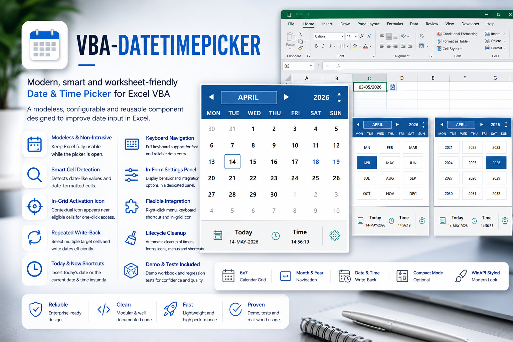
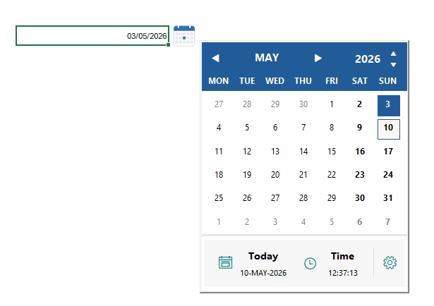
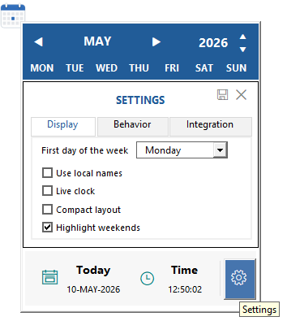
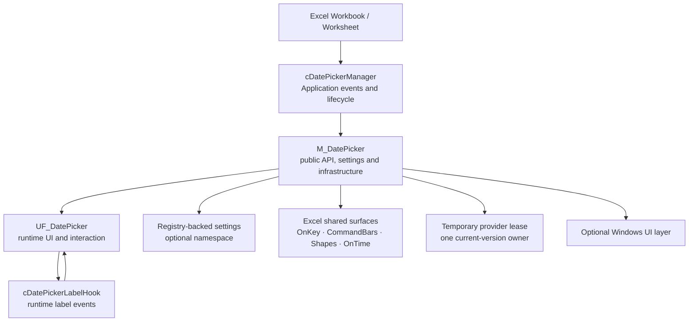
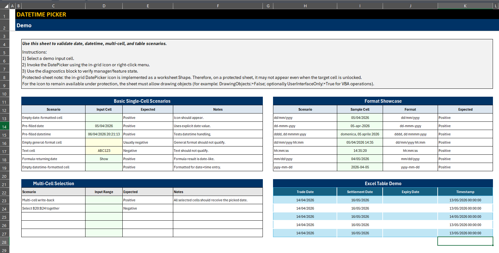

<div align="center">

# 📅 VBA Date / Time Picker

### A modern, source-first Date / Time Picker for Excel VBA

**Modeless UX · Safe worksheet write-back · Right-click and in-grid access · Optional Ribbon · Settings namespaces · Single-provider protection · Structured diagnostics · Regression harness**

<br>

[](https://github.com/danielep71/VBA-DATETIMEPICKER)
[](#requirements)
[](#release-status)
[](#regression-testing)
[](LICENSE)

<br>

[](https://github.com/danielep71/VBA-DATETIMEPICKER/releases)
[](https://github.com/danielep71/VBA-DATETIMEPICKER/issues)
[](https://github.com/danielep71/VBA-DATETIMEPICKER/stargazers)

<br>

**No installer for source import · No admin rights required for embedded use · No COM add-in · No third-party DLL · No external runtime dependency**

[Quick start](#quick-start)
&nbsp;·&nbsp;
[Installation](#installation)
&nbsp;·&nbsp;
[Write-back safety](#write-back-safety)
&nbsp;·&nbsp;
[Public API](#public-api)
&nbsp;·&nbsp;
[Architecture](#architecture)
&nbsp;·&nbsp;
[Regression tests](#regression-testing)
&nbsp;·&nbsp;
[Wiki](https://github.com/danielep71/VBA-DATETIMEPICKER/wiki)
&nbsp;·&nbsp;
[Releases](https://github.com/danielep71/VBA-DATETIMEPICKER/releases)

---

<p align="center">
  
</p>

---

</div>

> [!IMPORTANT]
> **Source-first deployment is the primary model.** Import the VBA source directly
> into the workbook when you want the picker to travel with the file and work on
> managed machines without add-in installation rights.
>
> A prebuilt `.xlam` remains available as a convenience for users who can install
> Excel add-ins.

> [!NOTE]
> The ready-to-run demo workbook is **not versioned as a binary in the repository**.
> Demo `.xlsm` files are generated from reviewable VBA source and distributed as
> GitHub Release assets.

## ✨ What this project is

**VBA Date / Time Picker** is a reusable Excel VBA component for fast, worksheet-friendly date and date-time entry.

It is designed for real workbook workflows rather than an isolated UserForm demo:

- a **modeless** Date / Time Picker that leaves Excel usable while open;
- date-only and date-time write-back through calendar selection, **Today** and **Now**;
- smart date-cell eligibility and initialization from existing worksheet values;
- configurable **right-click**, **in-grid icon**, **keyboard** and **Ribbon** entry points;
- full keyboard navigation inside the picker;
- optional compact layout, live clock and weekend highlighting;
- optional Windows title-bar styling and mouse-positioning support;
- registry-backed settings with **optional deployment namespaces**;
- a **single-provider lease** — introduced in `v1.2.0`, enforced on every entry path since `v1.2.1` — that refuses a second current-version provider before it can overwrite shared Excel registrations;
- structured write-back and native-window outcomes for operations that can partially succeed;
- a regression harness that distinguishes assertion failure, cleanup failure, dirty start and incomplete execution.

The component is intentionally source-control friendly. The authoritative implementation is plain `.bas`, `.cls`, `.frm`, `.frx` and RibbonX source.

---

## ⭐ Why use it

Excel still has a surprisingly large gap between:

```text
cell needs a date
```

and:

```text
user gets a polished, reusable date-entry experience
```

This project fills that gap without requiring a custom COM component, external DLL or installer.

It is especially useful when:

- workbooks are distributed to colleagues who should not install anything;
- corporate machines are locked down;
- the VBA source itself must remain reviewable;
- the workbook needs multiple access paths rather than one hard-coded button;
- date-entry logic must coexist with protected cells, formulas and Excel Tables;
- lifecycle cleanup matters because the picker uses application-wide Excel surfaces.

---

## 🎯 Core capabilities

| Area | Capability | v1.2.1 behavior |
|---|---|---|
| Picker UX | Modeless Date / Time Picker | Excel remains interactive while the form is open |
| Calendar | Fixed 6 × 7 grid | Month/year navigation, outside-month dates and keyboard focus |
| Write-back | Calendar, Today, Now | Safe selected-cell default |
| Excel Tables | Explicit whole-column fill | `DP_FillTableColumn` with scope confirmation |
| Formula safety | Preserve formulas by default | Formula skips are reported, not silently overwritten |
| Partial writes | Structured result | `DP_WriteResult` reports attempted, written, skipped, failed and technical-failure detail for every cell that produced an outcome |
| Right-click | Cell context-menu entry | Independently configurable |
| In-grid icon | Contextual worksheet Shape | Independently configurable |
| Keyboard | `Ctrl + Shift + D` | Registered only when explicitly enabled |
| Ribbon | RibbonX callbacks | Optional `customUI14.xml` integration |
| Settings | Registry-backed | Legacy global scope or explicit deployment namespace |
| Runtime ownership | One current-version provider | Second current-version provider is refused on every entry path, before shared registration |
| WinAPI | Optional styling and positioning | 32-/64-bit aware; styling transaction is observable and recoverable |
| Testing | Regression harness | Clean-start, completion and cleanup-aware run states |

---

<p align="center">
  
</p>

---

<a id="quick-start"></a>

# ⚡ Quick start

## 1. Import the production source

Import:

```text
src/modules/M_DatePicker.bas
src/classes/cDatePickerManager.cls
src/classes/cDatePickerLabelHook.cls
src/forms/UF_DatePicker.frm
src/forms/UF_DatePicker.frx
```

If you use the Ribbon, also package:

```text
src/ribbon/customUI14.xml
```

Then compile:

```text
VBA Editor → Debug → Compile VBAProject
```

> [!IMPORTANT]
> Keep `UF_DatePicker.frm` and `UF_DatePicker.frx` together. The `.frx` contains
> the binary form resources referenced by the exported `.frm`.

## 2. Start and stop the component with the workbook

```vb
Option Explicit

Private Sub Workbook_Open()

    ' Optional: isolate this workbook's persisted DatePicker settings.
    ' Must be called before DP_Start because DP_Start loads settings.
    ' M_Settings_SetNamespace "MyWorkbook"

    DP_Start

End Sub

Private Sub Workbook_BeforeClose(Cancel As Boolean)

    DP_Stop

End Sub
```

For save/print cleanup:

```vb
Private Sub Workbook_BeforeSave(ByVal SaveAsUI As Boolean, Cancel As Boolean)

    If Cancel Then Exit Sub

    DP_Close
    M_GridIcon_PurgeAll

End Sub

Private Sub Workbook_BeforePrint(Cancel As Boolean)

    If Cancel Then Exit Sub

    DP_Close
    M_GridIcon_PurgeAll

End Sub
```

Do not duplicate worksheet `SelectionChange` orchestration in `ThisWorkbook`.
`cDatePickerManager` already centralizes the Application-level event flow.

## 3. Open the picker

```vb
DP_Show
```

Other common calls:

```vb
DP_Today
DP_Now
DP_Close
DP_Stop
```

## 4. Fill one Excel Table data column deliberately

Normal calendar selection, `DP_Today` and `DP_Now` write the **selected cell only**.

The explicit broad-write command is:

```vb
Dim Result As DP_WriteResult

Result = DP_FillTableColumn( _
            ValueToWrite:=VBA.Date, _
            ConfirmFill:=True)
```

`DP_FillTableColumn` is a **Function returning `DP_WriteResult`**. A caller can therefore inspect exactly what happened rather than assuming every predicted cell changed.

---

<a id="installation"></a>

# 🛠️ Installation

The three options below are the short form. For step-by-step import instructions,
upgrade paths from `v1.1.x`, deployment-model comparison and troubleshooting, see
**[INSTALLATION.md](INSTALLATION.md)**.

## Option 1 — embed the source in a workbook

Best for:

```text
shared workbooks
locked-down corporate desktops
portable business tools
source-controlled VBA projects
```

Steps:

1. Open the target workbook.
2. Press `Alt + F11`.
3. Import the production files listed above.
4. Ensure the Microsoft Forms library required by the UserForm is available.
5. Add the thin workbook lifecycle calls.
6. Compile the VBA project.
7. Save as `.xlsm` or `.xlsb`.

No installer or admin rights are required merely to embed the VBA source.

## Option 2 — use the demo workbook

Download:

```text
DATETIMEPICKER-demo-vx.y.z.xlsm
```

from the repository's [Releases](https://github.com/danielep71/VBA-DATETIMEPICKER/releases) page.

The binary demo is generated from:

```text
demo/M_DEMO_BUILDER.bas
demo/M_DP_DEMO.bas
```

rather than maintained as a hand-edited committed workbook.

The demo source can build the worksheet through:

```vb
DP_Demo_CreateDemoSheet
```

## Option 3 — install the `.xlam`

Download the add-in asset from
[GitHub Releases](https://github.com/danielep71/VBA-DATETIMEPICKER/releases). At
`v1.2.1` it is:

```text
DATETIMEPICKER v1.2.1.xlam
```

The `.xlam` filename separator has varied between releases — `v1.2.0` published
`DATETIMEPICKER.v1.2.0.xlam` — so take the exact name from the Release page, and
check its SHA-256 against the one published there.

Use this when you want the DatePicker available across workbooks and your Excel policy allows add-in installation.

> [!CAUTION]
> Do not mix a `v1.2.0` provider with a pre-`v1.2.0` provider and assume the new
> ownership protection applies. Older copies do not participate in the lease
> protocol.

---

<a id="write-back-safety"></a>

# 🛡️ Write-back safety

`v1.2.0` changes the write-back model from implicit/destructive to explicit/reportable.

## Selected table cells are single-cell by default

Historically, selecting one cell inside an Excel Table data column could expand the write to the whole data column.

The safe default is now:

```text
calendar selection
DP_Today
DP_Now
    ↓
selected cell only
```

Whole-column fill is still supported, but must be requested deliberately:

```text
DP_FillTableColumn
    ↓
resolve table data column
    ↓
show scope when confirmation is enabled
    ↓
write through the normal engine
```

## Formulas are preserved by default

| Cell state | Default action | Reported as |
|---|---|---|
| Empty | Write | Written |
| Literal value | Overwrite | Written |
| Ordinary formula | Preserve | Formula skip |
| Formula returning a date | Preserve | Formula skip |
| Protected + locked | Preserve | Locked skip |
| Array-formula cell | Do not mutate | Failure |
| Other write failure | Do not silently hide | Failure |

A displayed date is not the same thing as permission to destroy the formula that produced it.

For advanced callers, ordinary formulas can be replaced explicitly:

```vb
Result = DP_FillTableColumn( _
            ValueToWrite:=VBA.Date, _
            ConfirmFill:=True, _
            OverwriteFormulas:=True)
```

The override is per-call and is not persisted as a user setting.

## One structured write result

```vb
Public Type DP_WriteResult
    AttemptedCount          As Double
    WrittenCount            As Double

    LockedSkippedCount      As Double
    LockedSkippedAddresses  As String

    FormulaSkippedCount     As Double
    FormulaSkippedAddresses As String

    FailedCount             As Double
    FailedAddresses         As String

    ResolvedTargetAddress   As String
    ExpandedToTableColumn   As Boolean
    TableName               As String
    ColumnName              As String
    AreasCount              As Long

    TechnicalFailureOccurred    As Boolean
    TechnicalFailureStep        As String
    TechnicalFailureNumber      As Long
    TechnicalFailureDescription As String

    EventsDisabledByCaller  As Boolean
End Type
```

Completed results obey:

```text
AttemptedCount =
    WrittenCount +
    LockedSkippedCount +
    FormulaSkippedCount +
    FailedCount
```

A result with `TechnicalFailureOccurred = True` does **not** obey that identity. An unexpected error stops population rather than continuing to mutate the workbook, so the result reports only the outcomes observed before the fault, and `TechnicalFailureStep`, `TechnicalFailureNumber` and `TechnicalFailureDescription` carry the original cause. Test for `TechnicalFailureOccurred` before reconciling counts.

Skipped/failed address lists are worksheet-qualified and bounded for diagnostics while the counts remain exact. The bound is applied **per target area**, not per operation, so a discontiguous write can report more addresses in a category than a single-area write. Moving to one cap per operation is deferred to `v1.2.2`.

Example:

```vb
Dim Result As DP_WriteResult

Result = DP_FillTableColumn( _
            ValueToWrite:=DateSerial(2027, 3, 31), _
            ConfirmFill:=False)

Debug.Print "Attempted: "; Result.AttemptedCount
Debug.Print "Written:   "; Result.WrittenCount
Debug.Print "Formula:   "; Result.FormulaSkippedCount
Debug.Print "Locked:    "; Result.LockedSkippedCount
Debug.Print "Failed:    "; Result.FailedCount
```

---

## 🧠 Smart activation and date eligibility

The picker can initialize from date-like worksheet context, including:

- empty date-formatted cells;
- existing dates;
- existing date-times;
- supported date display formats;
- formulas whose displayed value is date-like.

Formula eligibility and formula overwrite policy are deliberately different:

```text
formula displays a date
    → picker may open from that date

user selects a new date
    → formula remains unless the caller explicitly opts into overwrite
```

---

## 🖱️ Entry points

The Date / Time Picker can be reached through:

- direct `DP_Show`;
- right-click menu;
- in-grid icon;
- `Ctrl + Shift + D`;
- RibbonX `Ribbon_ShowPicker`;
- a workbook-specific button or macro supplied by the host.

The three built-in interactive access paths are **independently configurable**:

```text
right-click
in-grid icon
keyboard shortcut
```

All three may be disabled at the same time.

That is valid configuration, not a state the component silently "repairs" by taking a global shortcut on the user's behalf.

---

## ⌨️ Keyboard behavior

### Open from Excel

```text
Ctrl + Shift + D
```

The shortcut is registered **only when explicitly enabled**.

### Navigate inside the picker

| Key | Action |
|---|---|
| `←` / `→` | Previous / next day |
| `↑` / `↓` | Previous / next week |
| `PageUp` / `PageDown` | Previous / next month |
| `Ctrl + PageUp` / `Ctrl + PageDown` | Previous / next year |
| `Home` / `End` | First / last day of displayed month |
| `Enter` / `Space` | Select highlighted date |
| `M` | Open month picker |
| `Y` | Open year picker |
| `T` | Write Today |
| `N` | Write Now |
| `Esc` | Dismiss overlay or close picker |

Letter shortcuts are ignored when Ctrl or Alt is pressed so the form does not unnecessarily steal broader Excel/add-in key combinations.

### Application-wide shortcut limitation

`Application.OnKey` is application-wide and Excel exposes no getter for the assignment it replaces.

Therefore, if you explicitly enable `Ctrl + Shift + D`:

```text
third-party binding
    ↓
DatePicker registration
    ↓
third-party binding may be displaced
```

The DatePicker cannot read, save or later restore that predecessor.

Removing the DatePicker shortcut restores **Excel default handling**, not an unknown prior macro.

If the key matters to another workbook/add-in, leave the DatePicker shortcut disabled and use `DP_Show`, the Ribbon, or your own button.

---

<p align="center">
  
</p>

---

## ⚙️ Settings and persistence

Settings are stored through VBA registry persistence.

### Default scope

Without a custom namespace:

```text
HKCU\Software\VB and VBA Program Settings\VBA_DATETIMEPICKER
```

This is intentionally backward compatible.

It is **per Windows user**, not per workbook.

So two deployments that never run simultaneously can still share saved preferences if they both use the default namespace.

### Isolate one deployment

Configure a namespace **before settings are loaded**:

```vb
Private Sub Workbook_Open()

    M_Settings_SetNamespace "TreasuryTool"
    DP_Start

End Sub
```

Persistence then uses:

```text
VBA_DATETIMEPICKER__TreasuryTool
```

Read the configured namespace with:

```vb
Debug.Print M_Settings_GetNamespace()
```

An empty string means the legacy/default scope.

### Namespace contract

```text
configure namespace
    ↓
first settings load
    ↓
namespace locked for the project/session
```

Changing it after settings have already loaded is refused. That avoids loading values from one scope and later saving them into another.

A custom namespace:

- starts from DatePicker defaults;
- does not automatically import the legacy global values;
- is not derived from workbook name/path;
- is not derived from the software version.

Those choices keep persistence stable across rename, move, Save As and upgrades.

### Typical settings

| Area | Examples |
|---|---|
| Display | First day of week, local names, live clock, compact mode, weekend highlighting |
| Behavior | Close after selection, allow outside-month selection |
| Integration | Right-click, in-grid icon, keyboard shortcut (programmatic only — the panel has no control for it), WinAPI styling |
| Advanced | Holiday callback |

The persisted namespace is a **configuration scope**. It is not the runtime-provider identity described below.

---

## 🔒 One provider per Excel process

Many DatePicker surfaces are application-wide or use fixed shared identifiers:

```text
Application.OnKey
cell context-menu control
Application events
Application.OnTime timer
grid-icon naming
```

Two current-version copies must therefore not silently register over one another.

### Provider lease

The component uses a hidden, temporary, application-scoped CommandBar lease, introduced in `v1.2.0`:

```text
__VBA_DATETIMEPICKER_RUNTIME_PROVIDER_LEASE__
```

One hidden temporary control carries an ephemeral owner token.

The lease is:

```text
visible across VBA projects in one Excel process
not dependent on WinAPI
not stored in the registry
temporary for the Excel process
```

### Startup

```text
lease free
    → first current-version provider acquires
    → shared registrations may start

lease already owned
    → second current-version provider refused
    → owner remains untouched

any later entry path
    → DP_Show, DP_Preload, DP_Click, DP_OpenForActiveCell,
      keyboard, Ribbon_ShowPicker
    → ownership re-proved before the manager is reached
```

Acquisition occurs **before** shared registration. A provider that registered first and checked ownership afterwards would already have caused the collision the lease is meant to prevent.

Since `v1.2.1` this admission check runs on **every** runtime entry path. Through `v1.2.0` only `DP_Start` consulted the lease, so a refused copy could still reach the manager by another route and register shared state it later removed ([#37](https://github.com/danielep71/VBA-DATETIMEPICKER/issues/37)).

### Teardown and repair are guarded too

A refused provider cannot call:

```text
DP_Stop
DP_RepairRuntime
```

and dismantle the current owner's runtime.

Ownership is checked before destructive lifecycle operations.

Through `v1.2.0` this guard was reachable around: a refused copy could not call `DP_Stop` or `DP_RepairRuntime`, but it could register shared state through an unguarded entry path and remove the owner's during its own teardown.

### Stale lease

A VBA project reset clears the local owner token but can leave the process-visible lease behind.

The safe policy is:

```text
ownership cannot be proved
    → fail closed
```

Restarting Excel clears the temporary lease.

When you are certain no other DatePicker copy is running, an explicit operator recovery command exists:

```vb
DP_ForceReleaseProviderLease
```

> [!CAUTION]
> `DP_ForceReleaseProviderLease` deliberately releases without proving ownership.
> Use it only when you know the session contains no other live DatePicker provider.
> Restarting Excel is the safer recovery when uncertain.

### Mixed-version boundary

```text
v1.2.1 + v1.2.1
    → second current-version provider refused on every entry path

v1.2.1 + v1.2.0
    → v1.2.0 admits the lease only at DP_Start
    → not protected on any other entry path

v1.2.x + pre-v1.2.0
    → older copy has no lease protocol at all
    → ownership protection cannot be guaranteed
```

This is a compatibility boundary, not something the new provider can repair on behalf of already released older code.

---

<a id="public-api"></a>

# 🧩 Public API

The project deliberately keeps the normal consumer surface small even though VBA callbacks and cross-module architecture require additional `Public` procedures internally.

## Primary consumer API

| Member | Kind | Purpose |
|---|---|---|
| `DP_Start` | `Sub` | Start runtime integrations and ensure the manager is available |
| `DP_Stop` | `Sub` | Stop the owning provider and clean transient runtime resources |
| `DP_Show` | `Sub` | Open or refresh the picker for the active worksheet context |
| `DP_Close` | `Sub` | Close the picker and stop form-level runtime activity |
| `DP_Preload` | `Sub` | Load/hide the form once for fast first use |
| `DP_Hide` | `Sub` | Hide while keeping the form loaded |
| `DP_Today` | `Sub` | Write today's date to the current target |
| `DP_Now` | `Sub` | Write today's date plus current time |
| `DP_FillTableColumn` | `Function → DP_WriteResult` | Explicitly fill the selected Excel Table data column; formula-safe by default |
| `DP_RepairRuntime` | `Sub` | Explicit runtime repair path; may re-enable events |
| `DP_ForceReleaseProviderLease` | `Sub` | Operator-only recovery for a stranded provider lease |
| `M_Settings_SetNamespace` | `Sub` | Select an isolated persisted settings namespace before first settings load |
| `M_Settings_GetNamespace` | `Function → String` | Return configured namespace; empty means the legacy scope |

A normal host usually needs only:

```vb
DP_Start
DP_Show
DP_Close
DP_Stop
```

plus optional:

```vb
M_Settings_SetNamespace
```

before `DP_Start`.

## Public result types

### `DP_WriteResult`

Structured worksheet write-back outcome, including:

```text
attempted
written
locked skips
formula skips
failures
resolved target
table expansion metadata
area count
technical-failure detail (occurred, step, number, description)
caller event state
```

### `DP_WindowStyleResult`

Structured result of the borderless-window styling transaction:

```text
Attempted
Applied
Committed
RolledBack
RecoveryRequired
FailedStep
LastApiError
```

This lets the native window path distinguish:

```text
never attempted
fully applied
committed then rolled back
recovery still required
```

rather than collapsing all cases into a Boolean or no return value.

## Public enums

```vb
DP_WriteAction
DP_ClockMode
DP_SizeMode
```

## Ribbon callbacks

RibbonX callbacks remain `Public` in a standard module because Office resolves them by name:

```vb
Ribbon_ShowPicker
Ribbon_Reset
Ribbon_Demo
```

Ribbon layout belongs in:

```text
src/ribbon/customUI14.xml
```

Callbacks should stay thin and delegate to the normal DatePicker API.

## Advanced public maintenance helpers

The current source also exposes maintenance/integration procedures used by the host and Excel callback model, including:

```text
M_Picker_EnsureManager
M_ContextMenu_Update
M_KeyboardShortcut_Update
M_GridIcon_PurgeAll
```

`M_Picker_EnsureManager` reports caller event state without changing it.

### Internal test seams — not supported API

Some procedures are `Public` solely so the regression harness can reach them:

```text
M_Lease_Test_SilenceRefusalReport
M_Lease_Test_RefusalReportCount
M_Settings_ResolveKeyboardShortcutOnSave
M_WriteBack_Test_SetFaultInjection
```

They are internal infrastructure, may change or disappear without notice, and are to be classified `internal` under [#25](https://github.com/danielep71/VBA-DATETIMEPICKER/issues/25). Do not call them from host code.

---

## 🧭 Event-state contract

Normal DatePicker entry points preserve the caller's:

```vb
Application.EnableEvents
```

state.

That includes normal bootstrap/show paths such as:

```text
DP_Start
DP_Show
DP_Preload
M_Picker_EnsureManager
```

The explicit exception is:

```vb
DP_RepairRuntime
```

which is the recovery operation that may deliberately re-enable events.

> [!IMPORTANT]
> If your own transaction requires `Application.EnableEvents = False`, normal
> DatePicker entry points may be used without silently turning events back on.
> Do not call `DP_RepairRuntime` inside that transaction unless re-enabling events
> is intended.

`DP_WriteResult.EventsDisabledByCaller` records the event state observed on entry to a write-back operation.

---

<a id="architecture"></a>

# 🏗️ Architecture



## Component responsibilities

| Component | Responsibility |
|---|---|
| `M_DatePicker.bas` | Public API, settings, write-back engine, context menu, shortcut, grid icon, timer, Ribbon callbacks, WinAPI helpers, provider lease |
| `cDatePickerManager.cls` | Application-level Excel events, selection refresh, workbook/worksheet lifecycle orchestration |
| `UF_DatePicker.frm/.frx` | Modeless picker UI, calendar rendering, settings overlay, keyboard interaction, footer actions |
| `cDatePickerLabelHook.cls` | `WithEvents` routing for runtime-created MSForms labels |
| `customUI14.xml` | Optional RibbonX layout |
| `M_cDP_Test.bas` | Regression harness |
| `M_DEMO_BUILDER.bas` / `M_DP_DEMO.bas` | Source-built demo workbook/worksheet |

The manager, form and label hooks are deliberately separated so that high-frequency worksheet event handling does not become entangled with calendar rendering or dynamic label plumbing.

---

## 🪟 Borderless window hardening

The optional Windows styling path removes the native UserForm title bar while preserving a draggable custom header experience.

In `v1.2.0`, title-bar removal is treated as a transaction:

```text
read original style
    ↓
commit target style
    ↓
refresh non-client frame
    ↓
redraw
```

If a post-commit native step fails:

```text
rollback original style
```

is attempted.

The outcome is represented by `DP_WindowStyleResult`.

Critical invariant:

```text
Applied=True
or
RolledBack=True
or
RecoveryRequired=True
```

Since `v1.2.1` the component no longer treats a partially committed native style as a successful borderless window. Through `v1.2.0` the `RecoveryRequired` outcome was produced and then discarded at both call sites ([#47](https://github.com/danielep71/VBA-DATETIMEPICKER/issues/47)).

From `v1.2.1`, `RecoveryRequired=True` is terminal for that form load. The failed step and the last API error are recorded, and the picker fails rather than presenting a window whose style is neither fully applied nor rolled back. A subsequent load is unaffected.

WinAPI styling is optional. The runtime-provider lease is not: it uses the Office CommandBars model and therefore remains available even when WinAPI styling is disabled.

---

## 🖼️ In-grid activation

<p align="center">
  
</p>

The in-grid icon is a worksheet `Shape` positioned next to eligible cells.

High-frequency selection changes favor:

```text
show
move
hide
reuse
```

rather than destroy/recreate.

Hard lifecycle boundaries can remove or purge icons.

Tracked-shape liveness is verified before use, so deleting the underlying sheet/shape does not leave a stale VBA object reference masquerading as a live icon.

### Protected sheets

The icon may not be available when worksheet protection blocks drawing objects.

A host that needs the icon under protection should configure protection consistently with its own policy, for example:

```vb
DrawingObjects:=False
UserInterfaceOnly:=True
```

`UserInterfaceOnly:=True` is not persisted by Excel across sessions and normally needs to be re-applied after reopen.

---

<a id="regression-testing"></a>

# ✅ Regression testing

Optional regression module:

```text
test/M_cDP_Test.bas
```

Primary runners:

```vb
TST_DP_RunAll
TST_DP_RunAll_WithUISmoke
```

Environment probe:

```vb
TST_DP_ReportEnvironment
```

## Run states

A run reports exactly one of:

```text
PASS
FAIL
FAIL_CLEANUP
FAIL_DIRTY_START
INCOMPLETE_SKIPPED
```

### What `PASS` means

`PASS` is intentionally stronger than:

```text
all assertions that happened to run passed
```

A valid pass means:

```text
clean preflight
+
mandatory suites completed
+
assertions passed
+
required cleanup succeeded
+
observable final state verified
```

A previous aborted run is not silently ignored.

The harness uses both:

```text
module-state evidence
leftover TST_DP_SCRATCH worksheet
```

because a VBA project reset destroys module variables but does not delete a worksheet.

## Scratch-sheet setup

Excel was observed once reporting `1004` from `Worksheets.Add` after the new worksheet had already been created.

The harness therefore treats scratch-sheet creation transactionally:

```text
Add succeeds
    → normal path

Add reports failure + exactly one new worksheet exists
    → identify by object identity
    → validate candidate
    → adopt only if fully usable

zero new worksheets
    → fail loudly

multiple new worksheets
    → ambiguous ownership
    → delete nothing
    → fail loudly
```

It does not blindly retry `Worksheets.Add`.

## Latest recorded regression figures

```text
State=PASS; Run=431; Passed=431; Failed=0; CleanupFailures=0
```

This is the latest recorded **standard regression pack** for the `v1.2.1` cycle. With the UI smoke suite the figure is `434`. Both the embedded `.xlsm` and the packaged `.xlam` pass; `v1.2.1` certification was the first time the pack was runnable inside a packaged `.xlam` at all.

> [!IMPORTANT]
> Tests manipulate real Excel state: worksheets, settings, application flags,
> context-menu entries, keyboard registration, shapes and optional native UI.
> Run them in a controlled workbook/session.

---

## 🧪 Demo workbook

<p align="center">
  
</p>

The demo is generated from source and includes practical scenarios for:

- empty date-formatted cells;
- pre-filled dates and date-times;
- non-date text;
- formulas returning dates;
- common date/datetime display formats;
- multi-cell write-back;
- Excel Table behavior;
- explicit table-column fill;
- protected-sheet guidance;
- right-click, keyboard, Ribbon and in-grid access.

The key table demonstration is deliberate:

```text
pick a date in one Expiry Date cell
    → that cell changes

click Fill Table Column
    → whole column is proposed explicitly
    → scope is confirmed before write
```

---

## 📦 Repository structure

```text
VBA-DATETIMEPICKER/
├─ .github/
├─ assets/
│  ├─ datepicker-home2.png
│  ├─ datepicker-main.png
│  ├─ datepicker-settings.png
│  ├─ datepicker-ingrid.png
│  ├─ datepicker-monthnavigation.png
│  ├─ datepicker-yearnavigation.png
│  └─ datepicker-demosheet.png
├─ demo/
│  ├─ M_DEMO_BUILDER.bas
│  └─ M_DP_DEMO.bas
├─ dist/
│  └─ README.md
├─ images/
├─ src/
│  ├─ classes/
│  │  ├─ cDatePickerManager.cls
│  │  └─ cDatePickerLabelHook.cls
│  ├─ forms/
│  │  ├─ UF_DatePicker.frm
│  │  └─ UF_DatePicker.frx
│  ├─ modules/
│  │  └─ M_DatePicker.bas
│  └─ ribbon/
│     └─ customUI14.xml
├─ test/
│  └─ M_cDP_Test.bas
├─ CHANGELOG.md
├─ CODE_OF_CONDUCT.md
├─ CONTRIBUTING.md
├─ INSTALLATION.md
├─ LICENSE
├─ README.md
└─ SECURITY.md
```

The repository intentionally keeps source reviewable. Generated demo binaries belong in Releases rather than as opaque versioned workbook changes.

---

<a id="requirements"></a>

# 💻 Requirements

- Microsoft Excel desktop for Windows;
- VBA / macro-enabled workbook or Excel add-in host;
- Office 32-bit or 64-bit;
- MSForms/UserForms support;
- macro execution permitted by the host policy.

Optional Windows styling additionally requires the WinAPI calls used by the project to be permitted.

No third-party DLL, package manager, COM component or external runtime is required.

---

## ⚠️ Known limitations and boundaries

### One current-version provider at a time

`v1.2.1` deliberately supports:

```text
one active DatePicker provider per Excel process
```

and refuses a second current-version provider on every runtime entry path.

True multi-provider coexistence and arbitration remain a separate architectural problem.

### Mixed-version sessions are not protected

A pre-`v1.2.0` copy does not know the provider-lease protocol.

Do not assume:

```text
new embedded copy + old .xlam
```

is protected from interference.

### `Application.OnKey` cannot restore an unknown predecessor

If you explicitly enable `Ctrl + Shift + D`, it may displace another application-wide assignment. Excel does not expose the previous binding, so the DatePicker cannot restore it later.

### Default settings scope is user-global

Without `M_Settings_SetNamespace`, deployments share:

```text
VBA_DATETIMEPICKER
```

under the current Windows user's VBA settings registry.

Use an explicit stable namespace when independent deployments require independent persisted configuration.

### In-grid icon depends on worksheet Shape permissions

Protected sheets can prevent the icon from appearing even when the target cell itself is unlocked.

### Windows-first UI

The project is designed and documented for Excel desktop on Windows. Optional borderless styling and mouse/window helpers use Windows APIs.

### Accessibility / DPI

High-DPI, high-contrast and accessibility behavior should be validated in the target deployment environment; they are not yet treated as fully certified across all Office/display configurations. Tracked as [#29](https://github.com/danielep71/VBA-DATETIMEPICKER/issues/29).

### Known defect — `Ribbon_Demo` sheet toggle

`Ribbon_Demo` builds the demo sheet visible, then reads it as already visible and hides it again. The defect predates `v1.2.0` and was out of scope for the `v1.2.1` integrity hotfix. Deferred to `v1.2.2`; not yet filed as an issue.

### Diagnostic address caps are per area

Classification totals are always exact, but the bounded address lists are capped per target area rather than per operation. Deferred to `v1.2.2`.

### Release evidence is procedural, not automated

No CI runs the regression pack — the only workflow in the repository is repository traffic analytics ([#15](https://github.com/danielep71/VBA-DATETIMEPICKER/issues/15)). Artifact hashes establish file identity, not cryptographic source-to-binary provenance ([#16](https://github.com/danielep71/VBA-DATETIMEPICKER/issues/16)). The `Public` surface is larger than the supported API, and formal classification is outstanding ([#25](https://github.com/danielep71/VBA-DATETIMEPICKER/issues/25)).

### Certification environment

`v1.2.1` certification ran on a developer workstation with other add-ins loaded in the same Excel process, not in a clean VM. Recorded rather than implied.

---

## 🆘 Recovery guide

| Symptom | Recommended action |
|---|---|
| Picker not reacting to selection changes | Check `Application.EnableEvents`; use `DP_Start` or explicit `DP_RepairRuntime` if repair is intended |
| Runtime state appears damaged | `DP_RepairRuntime` |
| Stranded provider lease after VBA reset | Restart Excel; or `DP_ForceReleaseProviderLease` only when no other provider is alive |
| Grid icon remains | `M_GridIcon_PurgeAll` |
| Right-click entry missing | Check settings, then `M_ContextMenu_Update` |
| Keyboard shortcut missing | Check setting, then `M_KeyboardShortcut_Update` |
| Formula was expected to change but stayed intact | Formula protection is default; use an explicit overwrite-enabled advanced call only when intended |
| Whole Table column expected but one cell changed | Use `DP_FillTableColumn` |
| Test run refuses dirty start | Remove/resolve the predecessor's leftover state; do not treat the refusal as a test failure in current source |

---

## 📚 Documentation

The project Wiki was rewritten and reviewed for `v1.2.0`, and amended in `v1.2.1` for the corrections under [#17](https://github.com/danielep71/VBA-DATETIMEPICKER/issues/17).

The pages corrected in `v1.2.1` are stamped:

```text
Applies to:      v1.2.1
Reviewed commit: 7d55cc7
```

The remaining pages keep the `v1.2.0` review baseline, which is still accurate for them:

```text
6435c9170f1707a6269f2e307d158a0faf0cae21
```

The Wiki covers installation, API, manager/events, settings, testing/demo guidance, WinAPI behavior, Ribbon integration and deployment details.

| Resource | Purpose |
|---|---|
| [Wiki](https://github.com/danielep71/VBA-DATETIMEPICKER/wiki) | Extended installation, API and design documentation |
| [README.md](README.md) | High-level contract, usage, architecture and limitations |
| [CHANGELOG.md](CHANGELOG.md) | Release history and behavioral changes |
| [CONTRIBUTING.md](CONTRIBUTING.md) | Development workflow, coding rules and architecture decisions |
| [SECURITY.md](SECURITY.md) | Security reporting and safe-use guidance |
| [Regression tests](test/M_cDP_Test.bas) | Executable behavioral verification |
| [GitHub Releases](https://github.com/danielep71/VBA-DATETIMEPICKER/releases) | Published `.xlam`, demo workbook and release notes |

For source changes after the recorded Wiki baseline, the branch source and README remain the immediate reference until the next Wiki verification pass.

---

<a id="release-status"></a>

# 🧭 Release status

## v1.2.1 — integrity hotfix

`v1.2.1` corrects defects in behavior `v1.2.0` already claimed. It contains no
refactor and no new features, and no supported API name, signature or default
changed.

- provider-lease admission is enforced on **every** runtime entry path, not only
  `DP_Start` ([#37](https://github.com/danielep71/VBA-DATETIMEPICKER/issues/37));
- the settings panel no longer re-enables a keyboard shortcut the user disabled
  ([#42](https://github.com/danielep71/VBA-DATETIMEPICKER/issues/42));
- a write that stops partway returns the `DP_WriteResult` for the work already
  observed, instead of escaping as an exception carrying nothing
  ([#21](https://github.com/danielep71/VBA-DATETIMEPICKER/issues/21));
- an unrecoverable window-style failure no longer presents the form
  ([#47](https://github.com/danielep71/VBA-DATETIMEPICKER/issues/47));
- cleanup no longer destroys the primary error and reports `0` in its place
  ([#48](https://github.com/danielep71/VBA-DATETIMEPICKER/issues/48));
- the Wiki `Workbook_BeforeClose` recipe calls `DP_Stop` rather than the
  low-level helpers ([#17](https://github.com/danielep71/VBA-DATETIMEPICKER/issues/17)).

Certified at [`7d55cc7`](https://github.com/danielep71/VBA-DATETIMEPICKER/commit/7d55cc76f0b32a393663ab605b3d2c3d5852a71f).
Both hosts — the embedded demo `.xlsm` and the packaged `.xlam`:

```text
standard:       State=PASS; Run=431; Passed=431; Failed=0; CleanupFailures=0
with UI smoke:  State=PASS; Run=434; Passed=434; Failed=0; CleanupFailures=0
```

Certification voided three candidate commits. Every defect it found was in the
regression apparatus, not the component — `git diff ab15c92 7d55cc7 -- src/` is
empty. One of them was that the regression pack had never been runnable inside a
packaged `.xlam`, so these are the first regression figures this project has
gathered from the artifact it actually ships rather than from source alone.

---

## v1.2.0 — safety release

`v1.2.0` is centered on **safe defaults, observable outcomes and runtime containment**.

### Write-back safety

- single-cell default inside Excel Tables;
- explicit `DP_FillTableColumn`;
- `DP_WriteResult`;
- formula preservation with explicit override;
- partial-write reporting (made deterministic in `v1.2.1` — see [#21](https://github.com/danielep71/VBA-DATETIMEPICKER/issues/21)).

### Runtime safety

- one-provider process lease;
- refused-provider teardown/repair guards (completed in `v1.2.1` — see [#37](https://github.com/danielep71/VBA-DATETIMEPICKER/issues/37));
- explicit stale-lease recovery;
- settings namespace isolation;
- explicit application-wide keyboard limitation.

### Native UI safety

- transactional borderless styling;
- rollback;
- `RecoveryRequired` state (consumed from `v1.2.1` — see [#47](https://github.com/danielep71/VBA-DATETIMEPICKER/issues/47)).

### Test-evidence quality

- clean-start preflight;
- `FAIL_DIRTY_START`;
- cleanup-failure accounting;
- mandatory-suite completion tracking;
- observable final-state verification;
- safe recovery from the observed partial-commit `Worksheets.Add` anomaly.

Regression recorded for the `v1.2.0` cycle — source host only:

```text
State=PASS; Run=302; Passed=302; Failed=0; CleanupFailures=0
```

---

## 🔐 Security and trust

This project runs VBA inside Excel and can register application-level UI behavior.

Before deploying in a business-critical workbook:

- review the source used by your build;
- use only expected GitHub Release assets;
- follow your organization's macro policy;
- understand the process-wide provider and keyboard boundaries;
- test the exact Office build/bitness and workbook protection model used in production.

See [SECURITY.md](SECURITY.md).

---

## 🙏 Acknowledgements

`VBA-DATETIMEPICKER` was inspired by Sam Radakovitz's Excel Date Picker and by the broader VBA community's long tradition of building richer Excel input experiences with native VBA.

This implementation is independent and open source, with emphasis on:

```text
embeddable source
explicit API
defensive lifecycle management
structured outcomes
regression evidence
```

rather than a closed compiled-only component.

---

## 📌 Status

**Source status:** `v1.2.1` integrity-hotfix scope complete, on the `v1.2.0` safety-release baseline.

The project is suitable for controlled Excel/VBA environments when the documented ownership, settings and application-wide shortcut boundaries are respected.

The codebase remains intentionally conservative about claims it cannot prove:

- ambiguous provider ownership fails closed;
- formula preservation is explicit in the result;
- write scope is not inferred from convenience;
- cleanup quality participates in the test verdict;
- known Excel/platform observability limits are documented rather than hidden.

---

## 👤 Author

**Daniele Penza**

## 📄 License

Licensed under the [MIT License](LICENSE).
